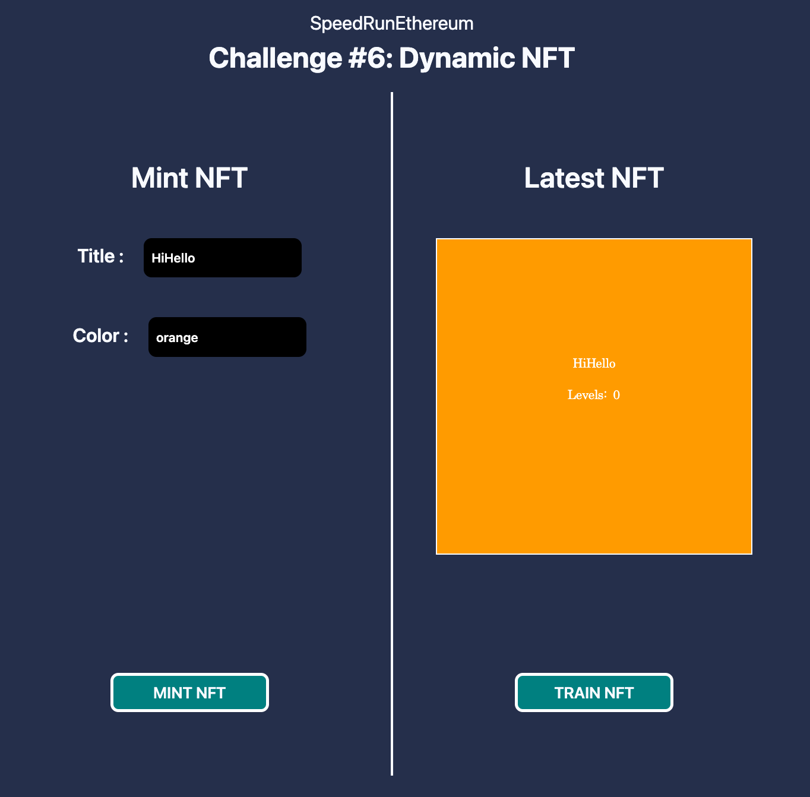
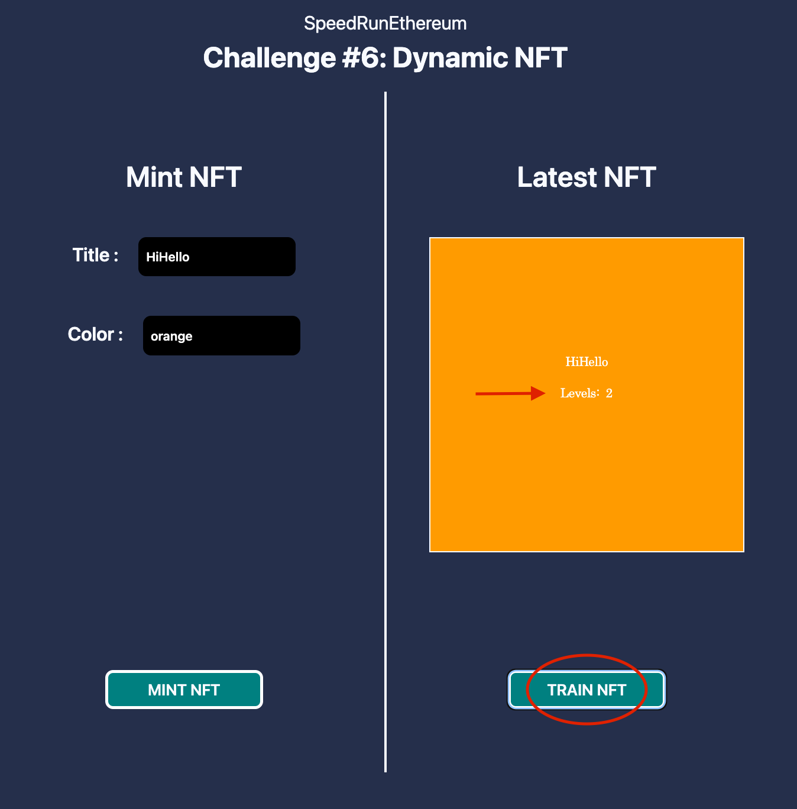
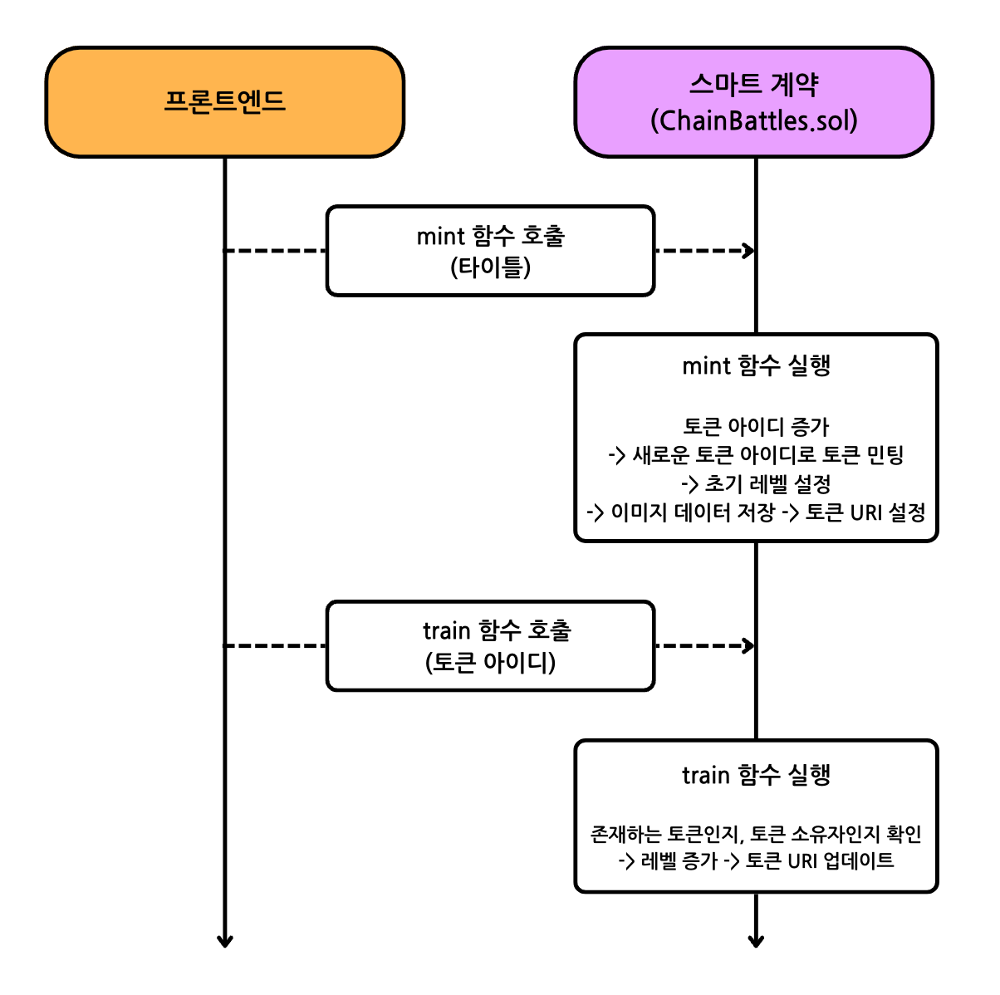

# Scaffold-ETH 2로 온체인 SVG 기반 다이나믹 NFT 만들기

## 🚩 Step 0. 다이나믹 NFT (feat. 온체인 메타데이터)

NFT를 생성할 때, 메타데이터를 중앙화된 객체 저장소나 IPFS와 같은 탈중앙화 저장소에 저장하는 것이 좋은 방법이다. 이는 이미지나 JSON 객체와 같은 대용량 데이터를 온체인에 직접 저장할 때 발생하는 막대한 가스 비용을 피하기 위함이다다.

하지만 여기에는 문제가 있는데,

메타데이터를 블록체인에 저장하지 않으면 스마트 계약에서 해당 메타데이터와 상호작용하는 것이 불가능하다는 것이다. 블록체인은 "외부 세계"와 통신할 수 없기 때문이다.

메타데이터를 스마트 계약에서 직접 업데이트하려면 온체인에 저장해야 하지만, 매번 발생하는 가스 비용은 어떻게 해야할?

다행히도, Arbitrum One과 같은 L2 체인들이 가스 비용을 대폭 줄여주는 여러 가지 장점을 제공하여 개발자들이 애플리케이션의 기능을 확장할 수 있도록 도와주고있다.

**⏩️ L2 (Layer2)란?** <br/>
L2는 기존 블록체인 위에 구축된 2차 프레임워크 또는 프로토콜을 의미한다. 이러한 프로토콜의 주요 목표는 주요 암호화폐 네트워크가 직면하고 있는 거래 속도와 확장성 문제를 해결하는 것이다.

> 🔥 이번 미션에서는 블록체인과의 상호작용에 따라 메타데이터가 변경되는 완전 동적 NFT를 온체인 메타데이터와 함께 만드는 방법을 배우고, 가스 비용을 낮추기 위해 이를 Arbitrum One 네트워크에 배포하는 방법을 배운다.

---

## 🚩 Step 1. 환경

프로젝트 클론해가기

```sh
git clone https://github.com/Ludium-Official/solidity-dapp-mission.git dynamic-nft
cd dynamic-nft
yarn install
```

<br/>

**🪪 배포자 (Deployer) 설정**

`packages/hardhat/.env` 및 `packages/nextjs/.env.local`을 수정한다.

```bash
# .env
ALCHEMY_API_KEY=
DEPLOYER_PRIVATE_KEY=
ARBISCAN_API_KEY=
```
본인 계정의 [Alchemy](https://dashboard.alchemy.com/apps) Apps API key와 소유하고 있는 지갑의 프라이빗 키, [Arbiscan](https://arbiscan.io/apis) API Key를 기입한다.

> Metamask 지갑의 경우, 계정 세부 정보로 들어가면 프라이빗 키를 얻을 수 있다.

<br/>

**🪝 컨트랙트 배포하기**

`packages/hardhat/hardhat.config.ts`에서 defaultNetwork를 `arbitrum`으로 변경한다.

```sh
yarn deploy
```

<br/>

**🏛️ 프론트엔드 배포하기**

`packages/nextjs/scaffold.config.ts`를 아래처럼 변경한다.

```typescript
const scaffoldConfig = {
  targetNetworks: [chains.arbitrum],

  // ...

  onlyLocalBurnerWallet: false,
} as const satisfies ScaffoldConfig;
```

NestJS 애플리케이션을 배포한다. [Vercel](https://vercel.com/) 에서 로그인 후 dashboard로 이동해 `Add New -> Project` 를 클릭한 후 GitHub repository를 임포트해온다.

```shell
yarn vercel
```

📱 Vercel이 제공하는 url 로 접속해서 애플리케이션 열기

---

## 🚩 Step 2. Abritrum One - 더 낮은 가스 비용과 더 빠른 거래

Arbitrum One은 이더리움 블록체인의 확장성을 향상시키기 위해 설계된 Layer 2 솔루션으로, Layer 2 솔루션은 메인 블록체인(Layer 1)의 기능을 보완하고 거래 처리 속도를 높이며 수수료를 줄이는 데 중점을 둔다.

Arbitrum One은 많은 거래를 이더리움 메인넷으로 보내지 않고도 처리할 수 있어 확장성을 크게 향상시킨다. 이는 더 많은 거래를 동시에 처리할 수 있게 하여 네트워크 혼잡을 줄인다.

Layer 2 솔루션은 이더리움의 높은 가스비를 줄이는 데 도움을 주는데, Arbitrum One에서는 롤업 기술을 사용하여 다수의 거래를 하나의 거래로 압축해 이더리움 메인넷에 기록함으로써 수수료를 절감한다.

**[Arbitrum One의 작동 방식]**

1.	옵티미스틱 롤업

    옵티미스틱 롤업에서는 거래가 기본적으로 유효한 것으로 간주되며, 검증자들이 사후적으로 오류를 제기할 수 있는 기간이 주어진다. 이 방식은 거래 검증을 신속하게 수행할 수 있도록 해주며, 거래 속도를 높이고 수수료를 줄이는 데 기여한다.

2.	오프체인 사용

    대부분의 거래를 체인 외(off-chain)에서 처리하고, 최종 결과만 이더리움 메인넷에 기록함으로써 이더리움 블록체인의 부담을 줄이고 더 많은 거래를 처리할 수 있게 한다.

3.	결과 기록

    체인 외에서 처리된 거래의 최종 결과는 롤업 계약을 통해 이더리움 메인넷에 기록된다. 이 과정에서 필요한 데이터만 메인넷에 저장되므로 데이터 저장 비용을 절감할 수 있다.

> 🔍 [L2 체인이 거래 비용을 낮추고 거래 속도를 높이는 방법](https://www.one37pm.com/nft/what-are-layer-2-solutions-and-why-are-they-important)

---

## 🚩 Step 3. Metamask 지갑에 Arbitrum One 추가

1. MetaMask 확장 프로그램 아이콘을 클릭
2. 좌측 상단의 네트워크 드롭다운 메뉴를 클릭하고 `+ 네트워크 추가` 버튼을 클릭
3. Arbitrum One 선택하여 추가

혹은 [Chainlist](https://chainlist.org/chain/80002)에 들어가서 원하는 네트워크를 찾아 쉽게 추가할 수 있다.

---

## 🚩 Step 4. SVG (scalable vector graphic file)

SVG 파일은 확장 가능한 벡터 그래픽 파일의 약자로, 인터넷에서 2차원 이미지를 렌더링하는 데 사용되는 표준 그래픽 파일 유형이다. 다른 인기 있는 이미지 파일 형식과 달리 SVG 형식은 이미지를 벡터로 저장한다.

> ⏩️ **벡터** <br/>
수학 공식에 따라 점, 선, 곡선 및 모양으로 구성된 그래픽 유형

SVG 파일은 디지털 정보를 저장하고 전송하는 데 사용되는 마크업 언어인 XML로 작성된. SVG 파일의 XML 코드는 이미지를 구성하는 모든 모양, 색상 및 텍스트를 지정한다.

```xml
<svg xmlns="http://www.w3.org/2000/svg" preserveAspectRatio="xMinYMin meet" viewBox="0 0 350 350">
   <style>.base { fill: white; font-family: serif; font-size: 14px; }</style>
   <rect width="100%" height="100%" fill="black" />
   <text x="50%" y="40%" class="base" dominant-baseline="middle" text-anchor="middle">Warrior</text>
   <text x="50%" y="50%" class="base" dominant-baseline="middle" text-anchor="middle">Levels: getLevels(tokenId)</text>
 </svg>
```

SVG는 코드를 사용하여 쉽게 수정하고 생성할 수 있으며, Base64 데이터로 쉽게 변환할 수 있는 장점이 있다.

Base64 이미지는 호스팅 제공업체 없이 브라우저에서 표시할 수 있기 때문에 체인 상에 객체 스토리지 없이 이미지를 저장할 수 있게 된다.

---

## 🚩 Step 5. 민팅 (Minting)

> ✏️ 'Home' 탭에서 `Title`과 `Color`를 입력한 후 **MINT NFT** 버튼을 클릭한다.

</img>

입력한 Title과 초기 레벨 0을 메타데이터로 가진 NFT가 생성된 것을 확인할 수 있다.

---

## 🚩 Step 5. 메타데이터 업데이트

이번에는 NFT를 훈련시켜 레벨을 올려보자.

우측 하단의 `TRAIN NFT` 버튼을 클릭하면, NFT의 레벨이 올라가는 것을 확인할 수 있다.

</img>


**[Mint & Train Sequence]**
</img>

