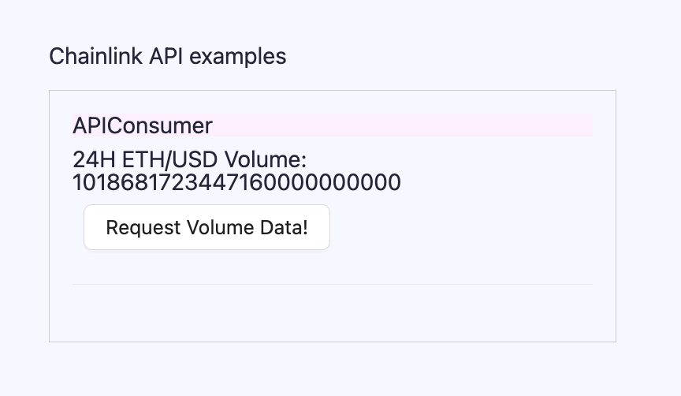

# Scaffold-ETH 2로 간단한 Oracle 사용 해보기 (Part3)

## 🚩 Step 0. Oracle

> 🔥 이번 미션은 총 3개의 파트로 구성 되어있으며 파트 1과 파트 2에서는 chainlink의 VRF기능을 사용하여 랜덤 값을 가져오는 방법을, 파트 3에서는 APIConsumer를 사용하여 코인의 시세를 가져오는 예제를 구현한다.

> ❗️ Chainlink VRF 사용시 Subscription이 필요하므로 이번 미션에서는 hardhat 체인이 sepolia testnet에서 실행한다.<br/> 만일 hardhat에서 실행하고자 한다면 [[Chainlink VRF Docs]](https://docs.chain.link/vrf) 의 개발 문서를 참고한다.<br />

---

## 🚩 Step 1. 환경

Scaffod-ETH 2 프로젝트 생성 및 의존성 설치

=> 새로운 프로젝트를 생성할지 만들어놓은 프로젝트를 clone해갈지 추후 결정

```sh
git clone -b oracle-part3 --single-branch https://github.com/Ludium-Official/solidity-dapp-mission.git oracle-part3
cd oracle-part3
yarn install
```

터미널에서 프론트엔드 시작하기

```sh
yarn start
```

세 번째 터미널에서 스마트 계약 배포하기

```sh
yarn deploy --network sepolia

# 아래 구문을 통해 언제든지 새로운 스마트 계약을 배포할 수 있다.
yarn deploy --network sepolia --reset
```

📱 http://localhost:3000 으로 접속해서 애플리케이션 열기

---

## 🚩 Step 2. LINK 토큰 충전

이번에는 subscription 이 아닌 스마트 계약에 LINK 토큰을 보내놓는다.

---

## 🚩 Step 3. 기능 실행



### Volume Data

`Request Volume Data!` 버튼을 클릭하여 volume data를 가져온다.

```solidity
    function requestVolumeData() public returns (bytes32 requestId) {
        Chainlink.Request memory req = _buildChainlinkRequest(
            jobId,
            address(this),
            this.fulfill.selector
        );

        // Set the URL to perform the GET request on
        req._add(
            "get",
            "https://min-api.cryptocompare.com/data/pricemultifull?fsyms=ETH&tsyms=USD"
        );

        // Set the path to find the desired data in the API response, where the response format is:
        // {"RAW":
        //   {"ETH":
        //    {"USD":
        //     {
        //      "VOLUME24HOUR": xxx.xxx,
        //     }
        //    }
        //   }
        //  }
        // request.add("path", "RAW.ETH.USD.VOLUME24HOUR"); // Chainlink nodes prior to 1.0.0 support this format
        req._add("path", "RAW,ETH,USD,VOLUME24HOUR"); // Chainlink nodes 1.0.0 and later support this format

        // Multiply the result by 1000000000000000000 to remove decimals
        int256 timesAmount = 10 ** 18;
        req._addInt("times", timesAmount);

        // Sends the request
        return _sendChainlinkRequest(req, fee);
    }
```

데이터를 요청할 때, `sendChainlinkRequestTo(req, fee)` 함수가 실제로 Chainlink 오라클의 컨트랙트를 호출한다.

이 때 정해진 fee 만큼 컨트랙트가 소유하고 있던 LINK 를 지불한다.

오라클 컨트랙트 요청을 Chainlink 노드에게 작업으로 제공하면, Chainlink 노드가 작업을 수행한다.

요청시 req 에 지시 사항을 첨부했으므로, Chainlink 노드는 HTTP GET 요청을 수행하고 필요한 데이터를 추출해 오라클 컨트랙트에 반환한다.