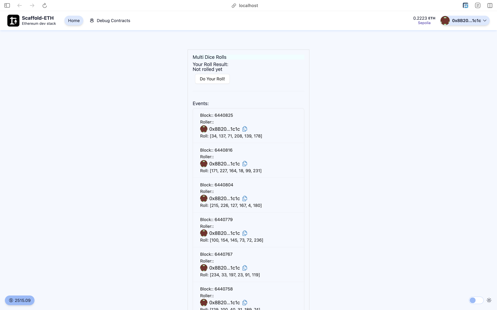

# Scaffold-ETH 2로 간단한 Oracle 사용 해보기 (Part2)

## 🚩 Step 0. Oracle

파트 2에서는 하나의 스마트 계약이 동시에 여러 무작위 기반 요청을 처리하는 **Chainlink VRF**(Verifiable Randomness)의 고급 사용 사례를 학습한다.

> 🔥 이번 미션은 총 3개의 파트로 구성 되어있으며 파트 1과 파트 2에서는 chainlink의 VRF기능을 사용하여 랜덤 값을 가져오는 방법을, 파트 3에서는 APIConsumer를 사용하여 코인의 시세를 가져오는 예제를 구현한다.

> ❗️ Chainlink VRF 사용시 Subscription이 필요하므로 이번 미션에서는 hardhat 체인이 sepolia testnet에서 실행한다.<br/> 만일 hardhat에서 실행하고자 한다면 [[Chainlink VRF Docs]](https://docs.chain.link/vrf) 의 개발 문서를 참고한다.<br />

---

## 🚩 Step 1. 환경

Scaffod-ETH 2 프로젝트 생성 및 의존성 설치

=> 새로운 프로젝트를 생성할지 만들어놓은 프로젝트를 clone해갈지 추후 결정

```sh
git clone -b oracle-part2 --single-branch https://github.com/Ludium-Official/solidity-dapp-mission.git oracle-part2
cd oracle-part2
yarn install
```

터미널에서 프론트엔드 시작하기

```sh
yarn start
```

세 번째 터미널에서 스마트 계약 배포하기

```sh
yarn deploy --network sepolia

# 아래 구문을 통해 언제든지 새로운 스마트 계약을 배포할 수 있다.
yarn deploy --network sepolia --reset
```

📱 http://localhost:3000 으로 접속해서 애플리케이션 열기

---

## 🚩 Step 2. Subscription과 Fund

Oracle Part1 과 동일하게 subscription ID 를 `packages/hardhat/.env` 에 넣은 후 스마트 계약을 배포한다.

---

## 🚩 Step 3. 기능 실행



### MultiDiceRolls

이번 미션에서는 Part 1의 DiceRolls 에서 발전하여, 여러 사용자의 주사위 굴리기를 동시에 추적한다.

우선 주사위 굴리기 요청을 하기 전, Subscription에 Sepolia ETH 와 LINK 를 보내둔다.

테스트넷 LINK는 [**이곳**](https://faucets.chain.link/)에서 받을 수 있다.

`Do Your Roll!` 버튼을 클릭하여 `requestRandomRoll()` 함수를 실행한다.

```solidity
function requestRandomRoll() public {
    uint256 reqId = s_vrfCoordinator.requestRandomWords(VRFV2PlusClient.RandomWordsRequest({
        keyHash: keyHash,
        subId: s_subscriptionId,
        requestConfirmations: requestConfirmations,
        callbackGasLimit: callbackGasLimit,
        numWords: numWords,
        extraArgs: VRFV2PlusClient._argsToBytes(VRFV2PlusClient.ExtraArgsV1({nativePayment: true}))
    }));

    requests[reqId] = msg.sender;
    rollResults[msg.sender].hasRequested = true;
    emit RequestRolled(reqId);
}
```

Chainlink VRF V2 Plus는 사용자가 무작위 값을 요청할 때 비용을 지불해야 하는데, 조금 전에 보내둔 LINK를 사용하도록 설정되어있기 때문에 충분한 수량이 들어있지 않으면 요청이 실패되니 주의하자.

요청이 성공적으로 완료되면 지난 번과 동일하게 Chainlink VRF 코디네이터가 자동으로 fulfillRandomWords() 함수를 호출하여 실행한다.

```solidity
function fulfillRandomWords(
    uint256 requestId,
    uint256[] calldata randomWords
) internal override {
    uint256[] memory _rollSet = Utilities.expand(randomWords[0], 6);
    rollResults[requests[requestId]].rollSet = _rollSet;

    emit Rolled(
        uint8(_rollSet[0]),
        uint8(_rollSet[1]),
        uint8(_rollSet[2]),
        uint8(_rollSet[3]),
        uint8(_rollSet[4]),
        uint8(_rollSet[5]),
        requests[requestId]
    );
}
```

여기서 등록된 이벤트는 프론트엔드에서 확인할 수 있다.