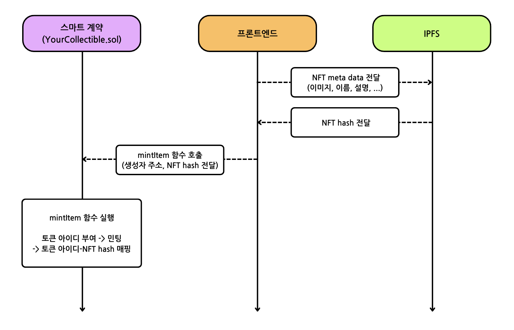

# Scaffold-ETH 2로 간단한 NFT 마켓 만들기 (ERC721)

## 🚩 Step 0. NFT란?

NFT(Non-fungible token, 대체 불가능 토큰)은 블록체인에 저장된 데이터 단위로, 고유하면서 상호 교환할 수 없는 토큰을 뜻한다. 

비트코인 등의 암호화폐와 달리 각 토큰에 고유한 식별 값이 할당되어 있어 중복으로 만들 수 없고 복제 또한 불가능하다. 또한 단순히 거래 내역만이 아닌, 소유권 및 판매 이력 등 디지털 자산 자체에 대한 정보가 블록체인에 저장되어있기 때문에 최초 발행자를 확인해 원본임을 증명할 수 있다.

사진, 그림, 영상, 음악, 더 나아가 부동산, 게임 아이템, 콘서트 티켓, 심지어 단순한 밈까지도 대체 불가능 토큰(NFT)으로 만들 수 있으며 다양한 분야에서 새로운 경제적 가치를 창출한다.

**[대표적인 NFT 마켓]** <br/>
[OpenSea](https://opensea.io/) <br/>
[Binance NFT](https://www.binance.com/en/nft/home)

> 🔥 이번 미션에서는 ERC-721 기반 NFT 컨트랙트를 배포하여 메타데이터를 IPFS에 저장하고 이를 민팅할 수 있는 웹앱 프론트엔드를 제작한다.

---

## 🚩 Step 1. 환경

Scaffod-ETH 2 프로젝트 생성 및 의존성 설치

=> 새로운 프로젝트를 생성할지 만들어놓은 프로젝트를 clone해갈지 추후 결정

```sh
git clone https://github.com/scaffold-eth/scaffold-eth-2.git my-nft-market
cd my-nft-market
yarn install
```

첫 번째 터미널에서 로컬 블록체인 초기화하기
```sh
yarn chain
```

두 번째 터미널에서 프론트엔드 시작하기
```sh
yarn start
```

세 번째 터미널에서 스마트 계약 배포하기
```sh
yarn deploy

# 아래 구문을 통해 언제든지 새로운 스마트 계약을 배포할 수 있다.
yarn deploy --reset
```

📱 http://localhost:3000 으로 접속해서 애플리케이션 열기

---

## 🚩 Step 2. 가스 & 지갑

> ⛽️ NFT를 민팅하기 전, 가스비를 지불하기 위한 자금이 필요할 것이다.


> 🦊 우선 Metamask와 연결하지 않는다. 만약 연결했다면 연결을 끊고 로컬호스트에 있는 burner 지갑(테스트용 토큰을 가진 일회용 지갑)을 사용한다.

<p>
  
  
</p>

> 👛 새 시크릿 창을 열고 http://localhost:3000으로 이동하면 오른쪽 상단에 새로운 지갑 주소가 표시되는 것을 확인할 수 있다. 시크릿 브라우저의 주소를 복사하고 첫 번째 브라우저에서 해당 주소로 로컬 테스트 자금을 보낸다. (왼쪽 하단 Faucet 버튼):


> 시크릿 창을 닫으면 지금 사용했던 계정은 영원히 사라진다. 버너 지갑은 로컬 개발에 매우 유용하지만, 공개 네트워크와 상호 작용할 때는 영구적인 지갑으로 이동하게 될 것이다.

---

## 🚩 Step 3. 민팅

> ✏️ 'My NFTs' 탭에서 **MINT NFT** 버튼을 클릭한다.


NFT가 생성되는 것을 볼 수 있다.


다시 한 번 새로운 시크릿 창을 열어 http://localhost:3000으로 이동한 후 해당 창의 지갑 주소로 NFT를 보낸다.


시크릿 창에서 NFT를 민팅해보자.

> 지갑 안에 자금이 없는 상태에서는 민팅을 할 수 없다. 가스비 지불을 위해 faucet에서 자금을 받아야 할 것이다!

🕵🏻‍♂️ Debug Contracts 탭에서 YourCollectible의 소유자 주소를 확인할 수 있다.

🔏 packages/hardhat/contracts에서 스마트 계약 YourCollectible.sol을 확인할 수 있다.

💼 packages/hardhat/deploy에서 배포 스크립트 00_deploy_your_contract.js를 확인할 수 있다.

📝 만약 프론트엔드를 수정하고 싶다면, `packages/nextjs/app` 로 이동해 원하는 특정 페이지를 열어 수정한다.
[routing](https://nextjs.org/docs/app/building-your-application/routing/defining-routes) 과 [pages/layouts](https://nextjs.org/docs/app/building-your-application/routing/pages-and-layouts) 구성에 대한 것은  Next.js 문서에서 확인할 수 있다.

**[NFT Minting Sequence]**
</img>

---

## 🚩 Step 4. 테스트넷 배포

지금까지는 로컬 환경에서 실행을 해봤다면, 이번에는 테스트넷에서 배포해보자.

> `packages/hardhat/hardhat.config.ts`에서 defaultNetwork를 `sepolia`로 변경한다.


`yarn generate` 명령어를 사용하여 배포자 주소를 생성한다. 이 명령은 고유한 배포자 주소를 생성하고 니모닉을 로컬에 저장한다.

이렇게 생성된 로컬 계정은 개인 프라이빗 키를 입력하지 않고도 계약을 배포할 수 있게 해준다.

`yarn account` 명령을 사용하여 배포자 계정 잔액을 확인한다.

지갑을 사용하여 배포자 주소로 sepoliaETH를 보내거나 선택한 네트워크의 공개 faucet에서 받을 수 있다.

인기 있는 faucet은 https://sepoliafaucet.com/ 및 https://www.infura.io/faucet/sepolia 등이 있다.

`yarn deploy` 명령을 사용하여 NFT 스마트 계약을 배포한다.

> hardhat.config.ts에서 defaultNetwork를 sepolia로 설정하거나 yarn deploy --network sepolia 명령을 사용할 수 있다.

---

## 🚩 Step 5. 프론트엔드

> `packages/nextjs/scaffold.config.ts`의 `targetNetwork`를 `chains.sepolia`로 변경한다.


> 프론트엔드에서 제대로 네트워크가 설정되었는지 볼 수 있다. (http://localhost:3000):


> 공공 테스트넷에 배포되었기 때문에, 이제 본인 소유의 지갑이나 burner 지갑에 연결해야한다. `burner wallets`은 오직 `hardhat`에서만 사용 가능하기 때문에 모든 체인에서 사용할 수 있도록 `packages/nextjs/scaffold.config.ts`의 `onlyLocalBurnerWallet`를 false로 변경한다.


> 💬 힌트: transfer 페이지의 로딩 속도를 높이려면 packages/nextjs/app/transfers/page.tsx에서 useScaffoldEventHistory에 전달되는 fromBlock을 계약이 배포된 blocknumber - 10으로 업데이트해볼 수 있다. 
```typescript
// 예시
const { data: transferEvents, isLoading } = useScaffoldEventHistory({
  contractName: "YourCollectible",
  eventName: "Transfer",
  // 여기서 n은 BigInt를 나타낸다.
  // 이 블록 번호를 찾으려면 Etherscan에서 배포 된 계약 주소를 검색하고 Contract Creation 트랜잭션 라인을 찾는다.
  fromBlock: 3750241n,
});
```

NextJS 애플리케이션을 배포한다.

```shell
yarn vercel
```

> Vercel에 배포하려면 로그인(이메일, Github 등) 후 기본 옵션을 사용하면 된다. Vercel이 공용 URL을 제공한다.

> 동일한 프로덕션 URL에 재배포하려면 yarn vercel --prod 명령을 실행한다. --prod 플래그를 생략하면 미리보기/테스트 URL로 배포된다.

⚠️ 애플리케이션이 잘 작동되는지 자동 테스트를 실행해보자.

```shell
yarn test
```

#### [프로덕션 급 애플리케이션을 위한 서드파티 서비스 구성]

기본적으로, Scaffold-ETH 2는 Alchemy와 Etherscan과 같은 인기 있는 서비스에 대한 사전 정의된 API 키를 제공한다. 이를 통해 이러한 서비스에 등록할 필요 없이 애플리케이션을 더 쉽게 개발하고 테스트할 수 있다.
이 기능은 SpeedRunEthereum을 완료하는 데 유용하다.

프로덕션 급 애플리케이션의 경우, 속도 제한 문제를 방지하기 위해 자체 API 키를 얻는 것이 좋.

🔷 ALCHEMY_API_KEY 변수는 `packages/hardhat/.env` 및 `packages/nextjs/.env.local`에 설정한다. Alchemy 대시보드에서 API 키를 생성할 수 있다.

📃 ETHERSCAN_API_KEY 변수는 `packages/hardhat/.env`에 설정한다. API 키는 여기에서 얻을 수 있다.

💬 힌트: 라이브 애플리케이션의 경우 Vercel/시스템 환경 구성에 env를 저장하고 로컬 테스트의 경우 .env.local을 사용하는 것이 좋다.

---

## 🚩 Step 6. 스마트 계약 검증

```shell
yarn verify --network sepolia
```

> 계약이 이미 검증되었다는 메시지가 표시되었다면, 이는 계약이 이미 이전에 검증된 상태임을 나타낸다.

### 🐟 Open Sea

> 내가 테스트넷에서 배포한 NFT를 Opensea에서 보고싶다면?
[Testnets Opensea](https://testnets.opensea.io/)

> NFT를 민팅했을 때 사용한 지갑과 동일한 지갑을 사용해야 한다.

