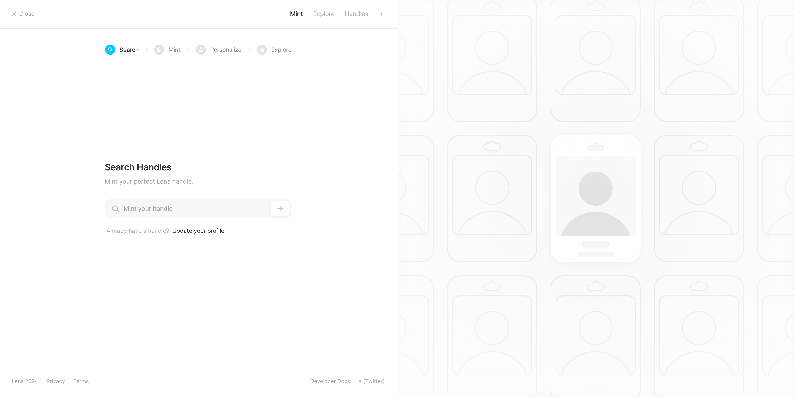
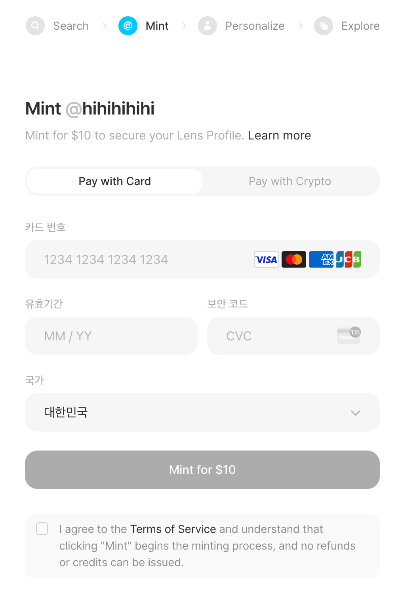
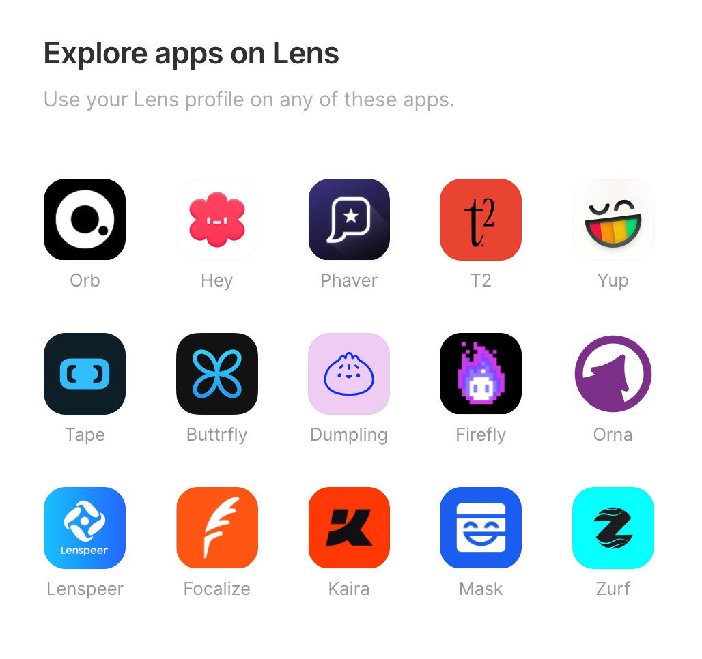
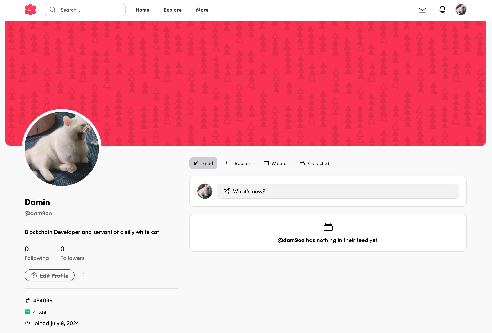
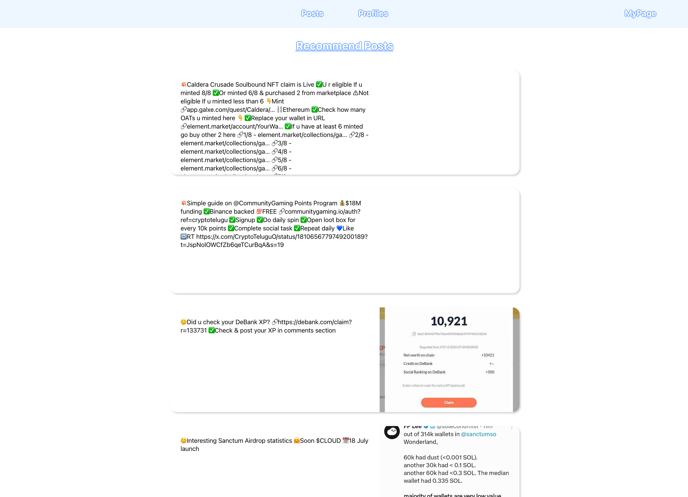
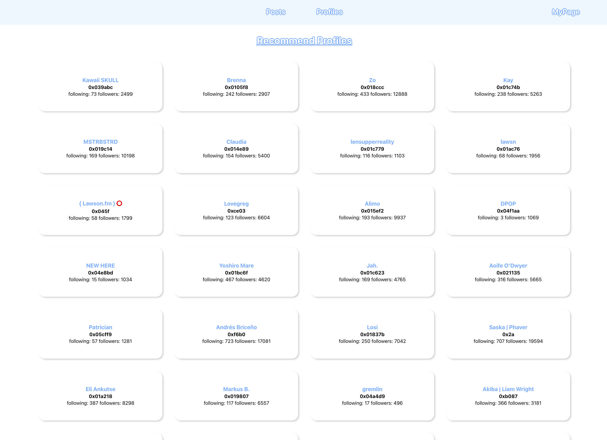
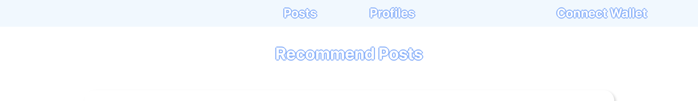
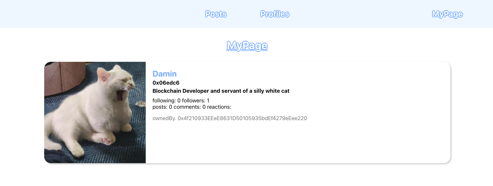

# Lens Protocol로 탈중앙화 소셜 미디어 플랫폼 만들기

## 🚩 Step 0. Lens Protocol

Lens Protocol은 블록체인 기반의 탈중앙화 소셜 그래프 프로토콜로, 사용자가 자신만의 탈중앙화 소셜 미디어 플랫폼을 쉽게 만들고 운영할 수 있도록 설계되었다.

**[Lens Protocol 특징]**

1.	탈중앙화 소셜 그래프:

    탈중앙화 소셜 그래프를 통해 사용자가 서로 연결되고 상호작용하는 방식을 제공한다. 중앙화된 소셜 미디어와 달리, 사용자는 자신의 데이터와 소셜 그래프를 완전히 제어할 수 있다.

2.	모듈성:

    모듈식 구조로 설계되어 있어, 개발자가 쉽게 새로운 기능을 추가하거나 기존 기능을 수정할 수 있다.

3.	NFT 프로필:

    사용자는 자신만의 NFT(Non-Fungible Token) 프로필을 생성할 수 있으며, NFT 프로필을 통해 사용자는 소셜 미디어 플랫폼 간에 쉽게 이동할 수 있다.

4.	콘텐츠 소유권:
    
    사용자는 Lens Protocol을 통해 생성한 콘텐츠에 대한 완전한 소유권을 가진다. 콘텐츠는 블록체인에 저장되어 변조가 불가능하며, 사용자는 자신의 콘텐츠를 자유롭게 관리할 수 있다.

5.	수익화 모델:

    사용자가 자신의 콘텐츠와 상호작용을 통해 수익을 창출할 수 있는 다양한 방법을 제공한다. 예를 들어, 사용자는 자신의 게시물에 대해 암호화폐나 토큰으로 팁을 받을 수 있다.

6.	상호운용성:

    여러 디앱 간에 쉽게 이동하고 상호작용할 수 있도록 한다.

> 🔥 이번 미션에서는 Lens Protocol을 사용하여 탈중앙화된 소셜 미디어 플랫폼을 만든다.

---

## 🚩 Step 1. Lens Protocol 프로필 생성



[Lens Protocol](https://www.lens.xyz/mint)에서 NFT 프로필을 Mint한다.



Mint를 위해 $10 혹은 8 MATIC을 결제한다.



NFT 프로필이 Mint되면, 여러 웹 애플리케이션에서 사용할 수 있다.



이러한 앱은 모두 서로 다른 팀에 의해 만들어졌으며 경험과 목적 또한 다르지만, 모든 기본 데이터는 마치 동일한 데이터베이스와 API를 사용하는 것처럼 동일하다.

이것이 가능한 이유는 모든 게시물, 댓글, 반응, 팔로우 등이 NFT로 저장되기 때문이다.

우리는 사용자로서 우리가 만드는 디지털 콘텐츠를 소유하고, 해당 프로토콜을 기반으로 구축된 모든 애플리케이션에서 사용할 수 있다.

---

## 🚩 Step 2. 환경

프로젝트를 클론하고 실행한다.

```sh
git clone -b decentralized-social --single-branch https://github.com/Ludium-Official/solidity-dapp-mission.git decentralized-social
cd decentralized-social
npm install
npm start
```
---

## 🚩 Step 3. 추천 포스트 & 추천 프로필

Lens Protocol 기반으로 한 커스텀 소셜 미디어 웹 애플리케이션을 만들어보자.

첫 번째로, 추천 포스트와 추천 프로필 목록을 가져와 보여준다.

Lens Matic 메인넷 API를 기본으로 하는 클라이언트를 설정하고, 필요한 Apollo GraphQL의 쿼리 문을 작성한다.

```javascript
// src/apollo-client.js

import { ApolloClient, InMemoryCache } from '@apollo/client';

const ENDPOINT = 'https://api-v2.lens.dev';

export const client = new ApolloClient({
  uri: ENDPOINT,
  cache: new InMemoryCache(),
});

// src/hooks/hooks.js

import { gql } from "@apollo/client";
import { client } from "../apollo-client";

export const recommendPosts = await client.query({
    query: gql`
    query Publications($orderBy: ExplorePublicationsOrderByType!) {
      explorePublications(request: {
        orderBy: $orderBy,
      }) {
        items {

            // ...

          }
        }
      }
    }
  `,
  variables: {
    orderBy: "TOP_REACTED",
    limit: 'TEN'
  },
})
```





---

## 🚩 Step 4. 내 프로필



우측 상단의 `Connect Wallet` 버튼을 눌러 지갑을 연결한다.

지갑이 연결되면 `MyPage` 버튼으로 바뀌고, MyPage로 이동하면 Lens Protocol 로그인 기능이 실행된다.


서명을 완료하면 내 프로필 정보를 확인해볼 수 있다.



---

## 🚩 Step 5. 추가 기능

[Lens Documentation](https://www.lens.xyz/docs)과 [Lens API GraphQL API Reference](https://api-v2-docs.lens.xyz/#introduction) 에서 원하는 기능을 찾아 프론트 웹 애플리케이션에 추가해보자.