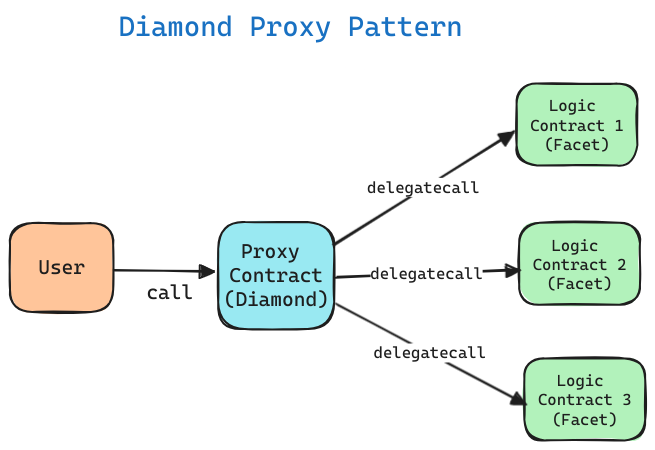
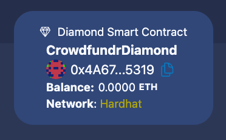
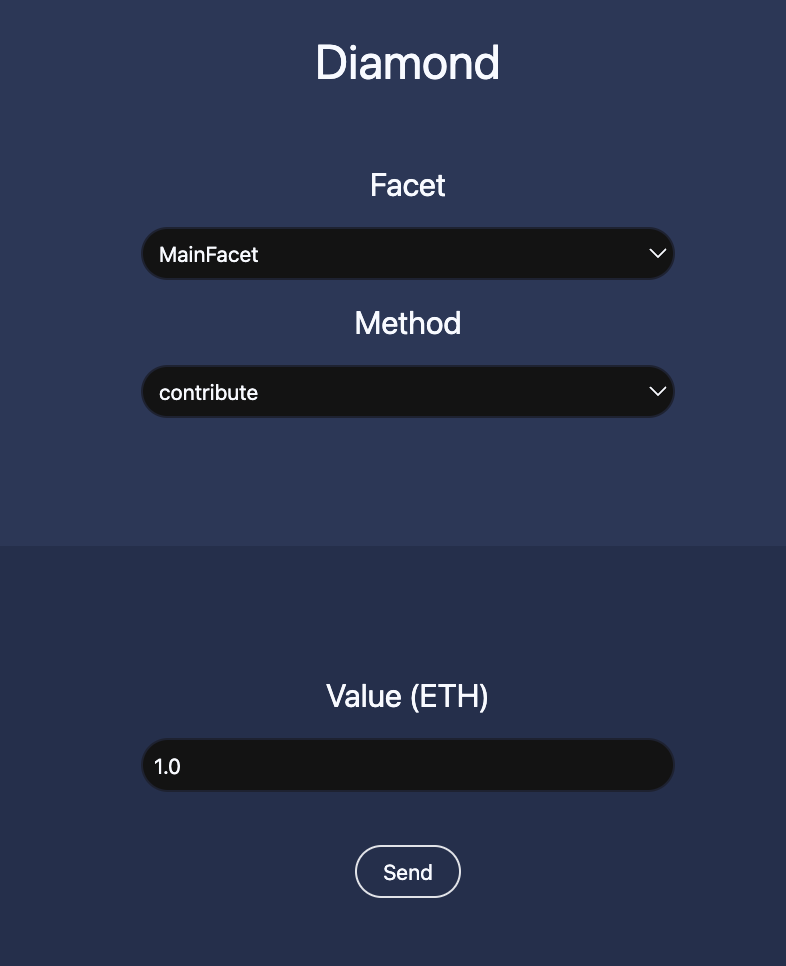
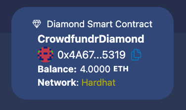
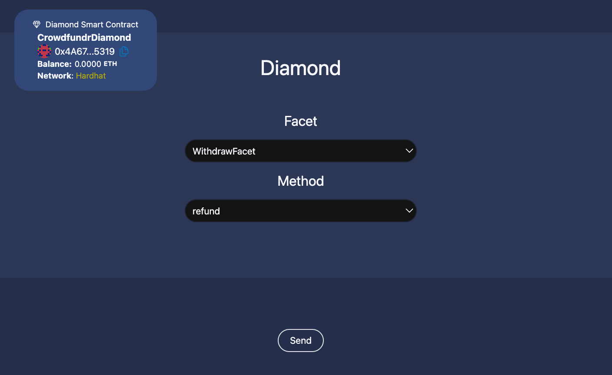
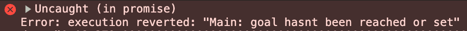

# Scaffold-ETH 2로 크라우드 펀딩 만들기

## 🚩 Step 0. Diamond 표준 (EIP-2535)

스마트 계약 개발은 유지해야 할 계약 로직이 많아질수록 매우 복잡해질 수 있다. 이 때, Diamond 표준 (EIP-2535)은 스마트 계약을 모듈화하고 효율적으로 업그레이드 및 관리하는 데 용이하다. 

Diamond 표준의 핵심 아이디어는 단일 Diamond 계약에서 여러 구현 계약(Facets)을 제어할 수 있다는 점이다. Diamond 표준의 주요 특징은 다음과 같다.

- 단일 게이트웨이를 통해 여러 구현 계약에 프록시 호출을 수행
- 단일 또는 여러 스마트 계약을 원자적으로 업그레이드
- Diamond에 추가할 수 있는 구현 계약의 수에 대한 저장 한도가 없음
- Diamond에서 이루어진 모든 업그레이드의 로그 기록
- 외부 함수 호출 수를 줄임으로써 가스 비용 절감 가능

Diamond 계약의 세 가지 핵심 구성 요소는 DiamondCut, DiamondStorage 및 표준 함수와 이벤트로, 이를 통해 Diamond 내의 내용과 업그레이드 시점을 확인할 수 있다.



<br />

> 🔥 이번 미션에서는 diamond와 facets을 사용하여 사용자가 기여하고 소유자가 언제든지 자금을 청구할 수 있는 크라우드 펀딩 애플리케이션을 만든다.

---

## 🚩 Step 1. 환경

프로젝트 클론해가기

```sh
git clone -b crowd-funding --single-branch https://github.com/Ludium-Official/solidity-dapp-mission.git crowd-funding
cd crowd-funding
yarn install
```

---

### Op1) 로컬 환경에서 실행

```sh
# 로컬 블록체인 초기화
yarn chain

# 스마트 계약 배포
yarn deploy

# 프론트엔드 실행
yarn start
```

📱 http://localhost:3000 으로 접속해서 애플리케이션 열기

---

### Op2) 테스트넷 환경에서 실행

**🪪 배포자 (Deployer) 설정**

***방법 1. 배포자 주소를 생성하여 사용***

주소가 생성되면 니모닉은 로컬에 저장되고, 프라이빗 키를 따로 입력하지 않고 계약을 배포할 수 있다.

```sh
# 배포자 주소 생성
yarn generate

# 로컬 계정 잔액 확인
yarn account
```
위에서 생성된 주소로 sepoliaETH를 보내거나 공개 faucet에서 받는다.

***방법 2. 실제 소유한 주소를 사용***

`packages/hardhat/.env` 및 `packages/nextjs/.env.local`을 수정한다.

```bash
# .env
ALCHEMY_API_KEY=
DEPLOYER_PRIVATE_KEY=
```
본인 계정의 [Alchemy](https://dashboard.alchemy.com/apps) Apps API key와 소유하고 있는 지갑의 프라이빗 키를 기입한다.

> Metamask 지갑의 경우, 계정 세부 정보로 들어가면 프라이빗 키를 얻을 수 있다.

<br/>

**🪝 배포하기**

***방법 1. defaultNetwork 설정***
`packages/hardhat/hardhat.config.ts`에서 defaultNetwork를 `sepolia`로 변경한다.

```sh
yarn deploy
```

***방법 2. 명령에서 네트워크 지정***
```sh
yarn deploy --network sepolia
```

<br/>

**🏛️ 프론트엔드 배포하기**

`packages/nextjs/scaffold.config.ts`를 아래처럼 변경한다.

```typescript
const scaffoldConfig = {
  targetNetworks: [chains.sepolia],

  // ...

  onlyLocalBurnerWallet: false,
} as const satisfies ScaffoldConfig;
```

NestJS 애플리케이션을 배포한다. [Vercel](https://vercel.com/) 에서 로그인 후 dashboard로 이동해 `Add New -> Project` 를 클릭한 후 GitHub repository를 임포트해온다.

```shell
yarn vercel
```

📱 Vercel이 제공하는 url 로 접속해서 애플리케이션 열기

---

## 🚩 Step 2. 펀딩 자금 보내기

`Home` 탭에 들어가면 가장 먼저 좌측 상단에서 Diamond 스마트 계약을 확인할 수 있다.



Diamond 스마트 계약에 자금을 보내기 위해 `MainFacet`의 `contribute()` 함수를 선택한다.



우선 1.0 ETH 를 보내보자.


위의 이유로 트랜잭션이 revert 된 것을 확인할 수 있다.

이는 초기 설정한 minAmount 보다 적은 금액이 보내졌기 때문인데,

```typescript
const functionCall = cDiamondInit.interface.encodeFunctionData("init", [ONE_ETHER * 4n]);
```

스마트 계약을 배포할 때, `CrowdfundrDiamondInit`의 init() 함수와 minAmount를 매개변수로 담은 calldata를 생성하고, `CrowdfundrDiamond`의 생성자 함수를 통해 실행한다.

```solidity
// packages/hardhat/contracts/CrowdfundrDiamondInit.sol

LibDiamond.DiamondStorage storage ds = LibDiamond.diamondStorage();

ds.minAmount = _minAmount;
```

minAmount는 Diamond storage에 저장되는데, 이 저장소는 각 Facet이 동일한 레이아웃을 사용하기 때문에 일관성이 유지된다.

실질적으로 데이터가 저장되는 곳은 `CrowdfundrDiamond` 스마트 계약이지만, `LibDiamond.sol` 라이브러리가 Diamond 스마트 계약의 특정 스토리지 슬롯에 접근할 수 있는 방법을 제공하기 때문에, 각 Facet이 이 저장소에 접근하여 데이터를 읽고 쓸 수 있게되는 것이다.

```solidity
// packages/hardhat/contracts/libraries/LibDiamond.sol

bytes32 constant DIAMOND_STORAGE_POSITION = keccak256("diamond.standard.diamond.storage");

function diamondStorage() internal pure returns (DiamondStorage storage ds) {
  bytes32 position = DIAMOND_STORAGE_POSITION;
  assembly {
    ds.slot := position
  }
}
```

이번에는 minAmount 이상의 금액을 보내보자.




트랜잭션이 성공하면서 Diamond 스마트 계약에 전송한 금액이 들어간 것을 볼 수 있다.

---

## 🚩 Step 3. fallback()

프론트엔드에서 실행하는 모든 sendTransaction(), call() 함수는 Diamond 스마트 계약의 fallback() 함수를 통해 이루어진다.

위의 Step2 를 진행할 때, 프론트엔드에서는 MainFacet의 interface로 contribute 함수의 calldata를 생성하고, Diamond 스마트 계약으로 트랜잭션을 전송한다.

```typescript
// packages/nextjs/app/page.tsx

const calldata = facetInterface.encodeFunctionData(methodName.name, args);

const tx = {
  to: diamondAddress,
  data: calldata,
  value: parseEther(value)
}

const res = await signer.sendTransaction(tx);
```

fallback() 함수는 Diamond 스마트 계약이 가지고 있지 않은 함수가 실행됐을 때 자동으로 실행된다.

Diamond Storage에 기록 되어있는 Facet 정보를 가지고, 해당 Facet에 delegatecall을 보내고 return 값이 있는 경우 반환한다.

---

## 🚩 Step 4. 펀딩 자금 돌려받기

`WithdrawFacet`의 `refund()` 함수를 선택하고 Send 버튼을 클릭한다.


위의 이유로 트랜잭션이 revert 된다.

`WithdrawFacet`의 `deadline()` 함수로 펀딩의 남은 기간을 확인할 수 있다.

초기 배포엣 1시간으로 설정하였기 때문에, 원활한 진행을 위해 5초로 바꾼 뒤 다시 배포해보자.

```typescript
// packages/hadrhat/deploy/01_deploy_your_contracts.ts

const tx = await cDiamond.setDeadline(5);
```

refund() 를 다시 실행하면 내가 보냈던 자금을 다시 돌려받을 수 있다.



---

## 🚩 Step 5. 펀딩 자금 청구하기

컨트랙트 소유자는 펀딩 자금이 목표를 달성하면 모인 펀딩 자금을 청구할 수 있다.

`MainFacet`의 `claim()`을 실행한다.



아직 목표 달성 전이라면 위의 에러와 함께 트랜잭션이 revert 된다.

초기에 목표 금액이 10 ETH 로 설정되었기 때문에, 달성 후 트랜잭션을 실행하면 펀딩 자금이 전부 컨트랙트 소유자에게 전송되는 것을 확인할 수 있다.