# Scaffold-ETH 2로 멀티 시그 만들기

## 🚩 Step 0. 멀티 시그 (Multi Signature)란?

우리가 사용하는 여러 블록체인 네트워크의 계정들은 일반적으로 1개의 서명을 요구하지만, 멀티 시그를 사용하도록 설정된 계정은 2개 이상의 서명을 필요로 한다.

2개 이상의 계정이 서명을 하도록 설정되는 경우, 한 계정의 프라이빗키가 해킹되거나 유출된다고 하더라도 자산의 탈취는 불가능하다. 서명을 하도록 설정된 가중치만큼의 계정들의 프라이빗 키를 모두 가지고 있어야 자산을 빼낼 수 있기 때문이다.

> Ex) 7개 계정 중 4개 이상이 서명해야 하는 경우에는 4개의 프라이빗 키가 필요

또한, 멀티 시그에서는 합의를 통한 운영이 가능하다. 만약 특정 프로젝트의 공동 창업자가 여러 명인 경우 과반수 이상이 찬성하는 경우에만 일을 진행할 수 있도록 멀티 시그를 통해 설정할 수 있다.

> Ex) 어떤 과업에 펀드를 집행하기로 한 경우, 5명 중 3명 이상이 서명을 통해 찬성표를 던지면 자산을 보냄

다중 서명 지갑은 이같이 잠재적인 이점이 있음에도 불구하고 복잡성과 잠재적인 위험을 안고 있으며, 사용자는 이 솔루션을 채택하기 전에 이러한 점을 이해하고 있어야 한다.

> 🔥 이번 미션에서는 멀티 시그 월렛으로 정해진 서명 개수를 충족했을 때 원하는 기능을 실행할 수 있는 웹앱 프론트엔드를 제작한다.

---

## 🚩 Step 1. 환경

프로젝트 클론해가기

```sh
git clone -b multi-sig --single-branch https://github.com/Ludium-Official/solidity-dapp-mission.git multi-sig
cd multi-sig
yarn install
```
---

### Op1) 로컬 환경에서 실행

```sh
# 로컬 블록체인 초기화
yarn chain

# 스마트 계약 배포
yarn deploy

# 프론트엔드 실행
yarn start
```

📱 http://localhost:3000 으로 접속해서 애플리케이션 열기

---

### Op2) 테스트넷 환경에서 실행

**🪪 배포자 (Deployer) 설정**

***방법 1. 배포자 주소를 생성하여 사용***

주소가 생성되면 니모닉은 로컬에 저장되고, 프라이빗 키를 따로 입력하지 않고 계약을 배포할 수 있다.

```sh
# 배포자 주소 생성
yarn generate

# 로컬 계정 잔액 확인
yarn account
```
위에서 생성된 주소로 sepoliaETH를 보내거나 공개 faucet에서 받는다.

***방법 2. 실제 소유한 주소를 사용***

`packages/hardhat/.env` 및 `packages/nextjs/.env.local`을 수정한다.

```bash
# .env
ALCHEMY_API_KEY=
DEPLOYER_PRIVATE_KEY=
```
본인 계정의 [Alchemy](https://dashboard.alchemy.com/apps) Apps API key와 소유하고 있는 지갑의 프라이빗 키를 기입한다.

> Metamask 지갑의 경우, 계정 세부 정보로 들어가면 프라이빗 키를 얻을 수 있다.

<br/>

**🪝 배포하기**

***방법 1. defaultNetwork 설정***
`packages/hardhat/hardhat.config.ts`에서 defaultNetwork를 `sepolia`로 변경한다.

```sh
yarn deploy
```

***방법 2. 명령에서 네트워크 지정***
```sh
yarn deploy --network sepolia
```

<br/>

**🏛️ 프론트엔드 배포하기**

`packages/nextjs/scaffold.config.ts`를 아래처럼 변경한다.

```typescript
const scaffoldConfig = {
  targetNetworks: [chains.sepolia],

  // ...

  onlyLocalBurnerWallet: false,
} as const satisfies ScaffoldConfig;
```

NestJS 애플리케이션을 배포한다. [Vercel](https://vercel.com/) 에서 로그인 후 dashboard로 이동해 `Add New -> Project` 를 클릭한 후 GitHub repository를 임포트해온다.

```shell
yarn vercel
```

📱 Vercel이 제공하는 url 로 접속해서 애플리케이션 열기

---

## 🚩 Step 2. 백엔드 서버 실행

추가적으로 이번 미션에서는 백엔드 서버를 함께 사용하기 때문에, 터미널을 추가로 열어서 아래 명령을 실행한다.

```bash
node packages/backend/index.js
```

멀티 시그에서 백엔드 서버를 사용하는 이유

1. 서명된 트랜잭션을 오프체인으로 기록하고 저장하여 필요할 때 데이터를 쉽게 검색할 수 있게 한다.

2. 동일한 트랜잭션이 여러 번 제출되는 것을 방지하기 위해 트랜잭션 해시를 키로 사용하여 저장하고 관리한다.

---

## 🚩 Step 3. 지갑 주소 설정

이번 미션에서는 서명에 필요한 서명자 객체를 ethers.js 라이브러리에서 제공하는 provider를 통해 받아오기 때문에, 서명을 요청할 때 provider가 인식할 수 있는 지갑을 사용해야 한다.

```typescript
// 현재 지정 네트워크와 상호작용하는 provider 객체 생성
const provider = new ethers.JsonRpcProvider(targetNetwork.rpcUrls.default.http[0]);

// 주어진 주소와 연결된 서명자 객체 가져오기
const signer = await provider.getSigner(account.address);
// JSON-RPC 메서드를 사용하여 트랜잭션 해시(txHash)의 서명을 생성
const signature = await signer.provider.send("personal_sign", [txHash, account.address])
```

로컬 환경에서 진행하는 경우, 로컬 블록체인에서 제공하는 가계정을 지갑에 연결하여 사용하자.

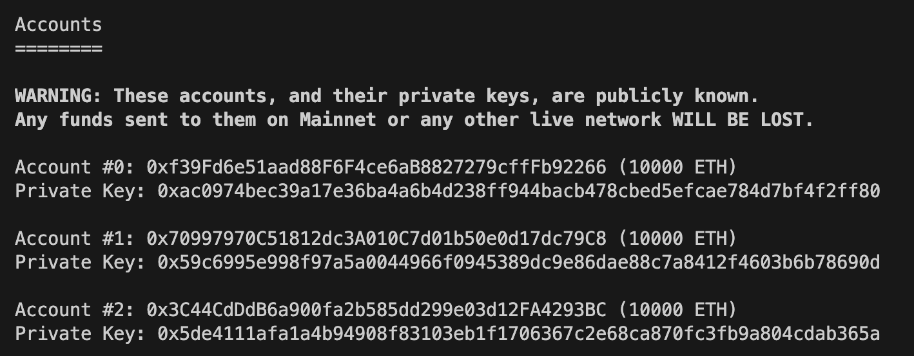

---

## 🚩 Step 4. 서명자 추가

`packages/hardhat/deploy/00_deploy_your_contract.ts`에서 배포에 필요한 매개변수로 체인 아이디, 초기 지갑 서명자 주소, 초기 필요한 서명 개수를 설정한다.

```typescript
await deploy("MetaMultiSigWallet", {
from: deployer,
// 매개변수: 체인 아이디, 초기 지갑 서명자 주소, 초기 필요한 서명 개수
args: [31337, [deployer], 1],
log: true,
autoMine: true,
});
```

배포가 완료되면 `Home` 탭에서 새로운 멀티 시그 지갑, `Owners` 탭에서 초기 설정한 서명자와 서명 개수를 확인할 수 있다.

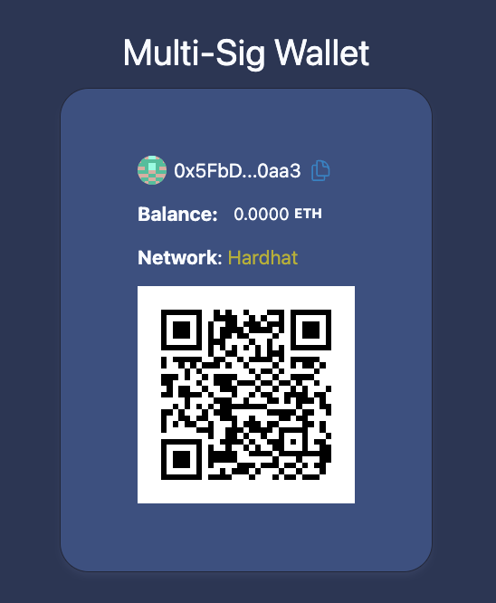

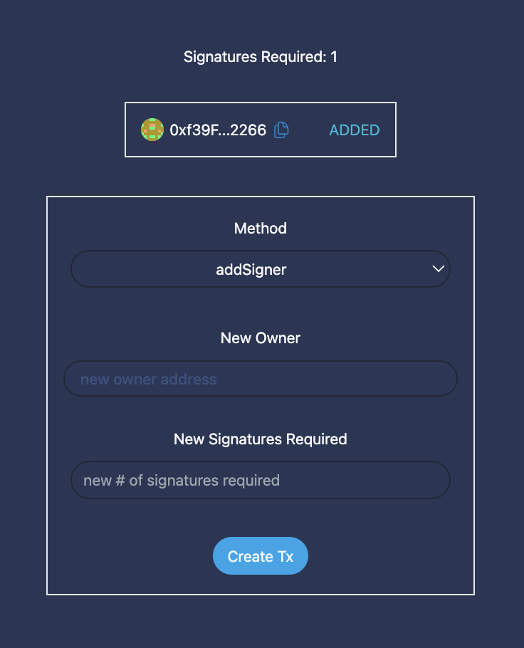

이제 `Owners` 탭에서 새로운 서명자를 추가해보자.

추가하고 싶은 주소와 서명의 수를 적고 `Create Tx` 버튼을 클릭한다.

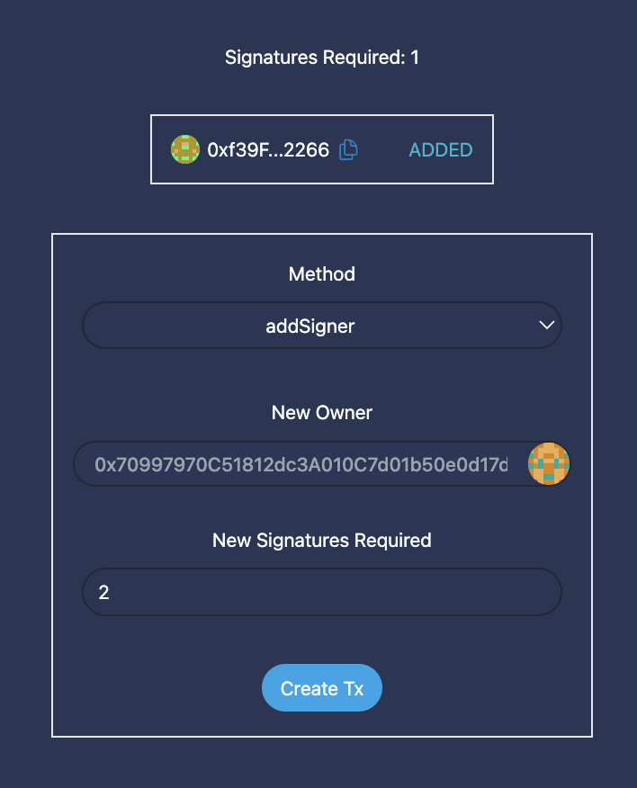

스마트 계약의 특정 함수를 호출하기 위한 calldata가 생성되고, `Create` 탭으로 넘어간다.

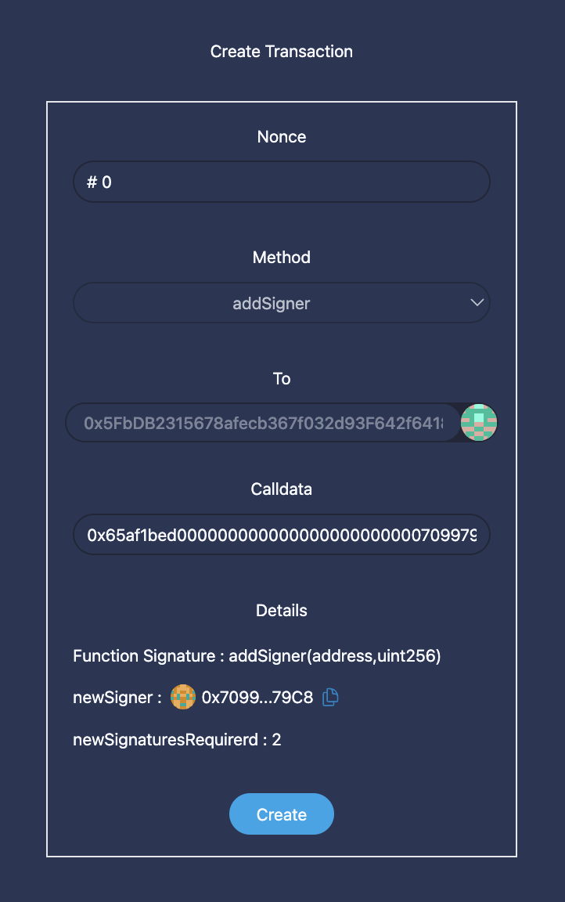

세부 내용을 확인한 후, `Create` 버튼을 클릭한다.

이 단계에서, 이번 트랜잭션에 대한 해시와 서명을 생성하고,

```solidity
// hardhat/MetaMultiSigWallet.sol

function getTransactionHash(uint256 _nonce, address to, uint256 value, bytes memory data) public view returns (bytes32) {
	return keccak256(abi.encodePacked(address(this), chainId, _nonce, to, value, data));
}
```

```typescript
// nextjs/app/create/page.tsx

const signature = await signer.provider.send("personal_sign", [txHash, account.address])
```

이 두 개의 값으로 서명을 복구한다.

```solidity
// hardhat/MetaMultiSigWallet.sol

function recover(bytes32 _hash, bytes memory _signature) public pure returns (address) {
	return _hash.toEthSignedMessageHash().recover(_signature);
}
```

복구한 주소가 지갑의 소유자가 맞는지 확인한 후, 맞다면 트랜잭션의 내용이 백엔드 서버에 저장되고 `Pool` 탭으로 넘어간다.

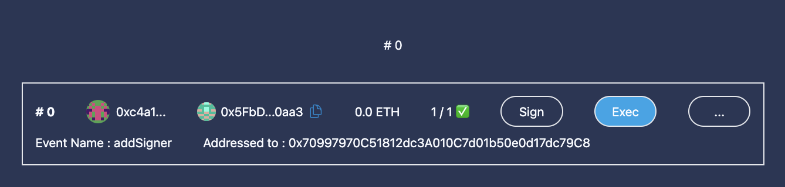

현재 대기 중인 트랜잭션 리스트를 확인할 수 있다.

해당 트랜잭션을 생성한 계정의 서명은 이미 추가된 상태이기 때문에, `Exec` 버튼을 눌러 최종적으로 트랜잭션을 실행한다.

```solidity
// hardhat/MetaMultiSigWallet.sol

function executeTransaction(address payable to, uint256 value, bytes memory data, bytes[] memory signatures)
	public
{
	// 소유자만 실행 가능함
	require(isOwner[msg.sender], "executeTransaction: only owners can execute");

	bytes32 _hash =  getTransactionHash(nonce, to, value, data); // 트랜잭션 해시
	nonce++; // nonce 증가
	uint256 validSignatures; // 유효 서명 수
	address duplicateGuard; // 중복 검사

	for (uint i = 0; i < signatures.length; i++) {
		address recovered = recover(_hash, signatures[i]); // 서명에서 주소 복구
		require(recovered != duplicateGuard, "executeTransaction: duplicate or unordered signatures");
		duplicateGuard = recovered;
		if(isOwner[recovered]){
			validSignatures++; // 유효 서명 증가
		}
	}

	// 유효 서명이 충분한지 확인
	require(validSignatures>=signaturesRequired, "executeTransaction: not enough valid signatures");

	// 트랜잭션 실행
	(bool success, ) = to.call{value: value}(data);
	console.log('result: ', success);
	require(success, "executeTransaction: tx failed");

	emit ExecuteTransaction(msg.sender, to, value, data, nonce-1, _hash);
}
```

최종적으로 Owners에 새로운 서명자가 추가되고, 서명 개수가 변경된 것을 확인할 수 있다.

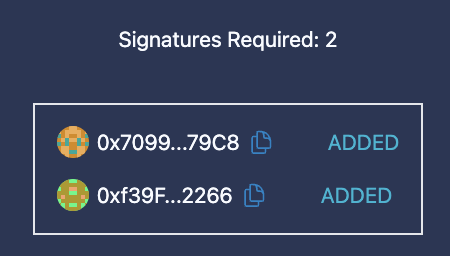

---

## 🚩 Step 5. 서명자 제거 & 서명 개수 충족

이번에는 추가했던 서명자를 다시 제거해보자.

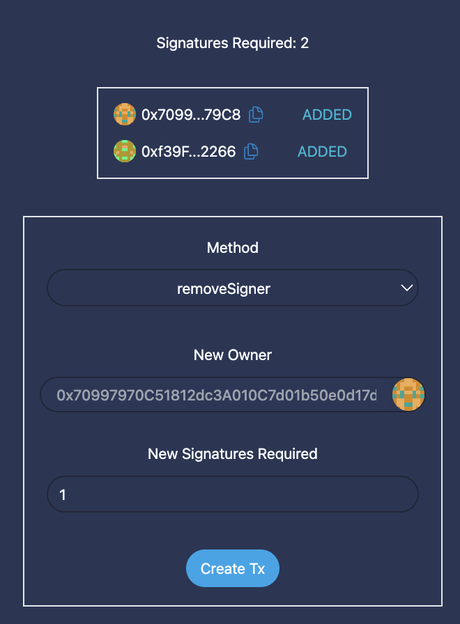

서명자를 제거하고 나면 최초 서명자 한 명만 남기 때문에 필요 서명 개수도 1개로 다시 변경한다.


트랜잭션 생성자의 서명 외에, 한 개의 서명이 더 필요한 것을 확인할 수 있다.

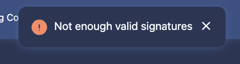

만약 서명 개수를 채우지 않고 `Exec` 버튼을 클릭하면, 서명 개수가 충분하지 않다는 문구가 뜬다.

트랜잭션 생성자 외에 다른 지갑 소유자 계정으로 변경하여 `Sign` 버튼을 클릭한다.

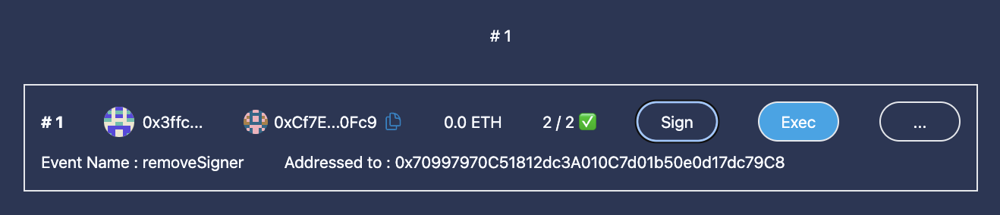

서명이 성공적으로 추가되었으면 `Exec` 버튼을 클릭해 트랜잭션을 실행할 수 있다.

---

**[Multi Sig Wallet Sequence]**

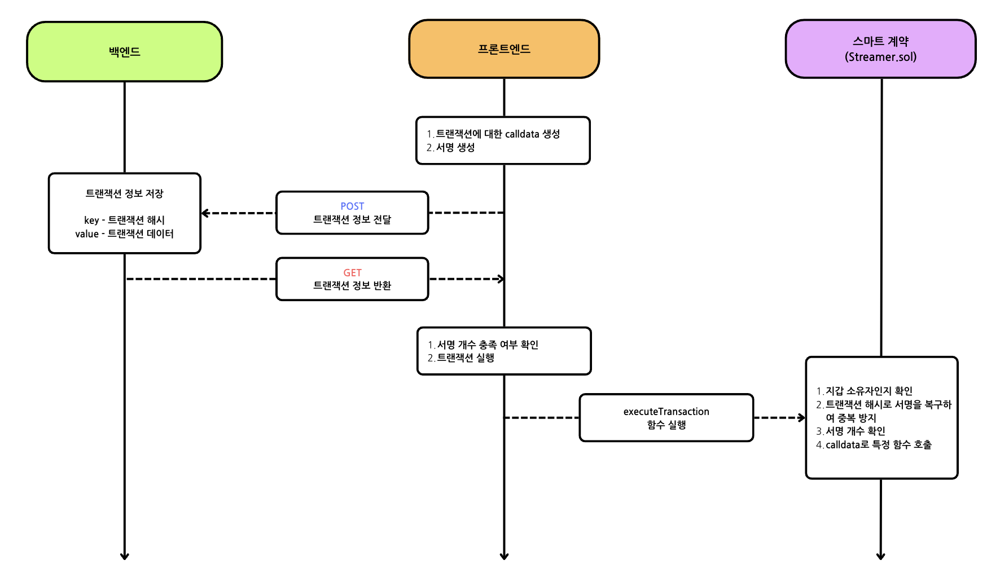