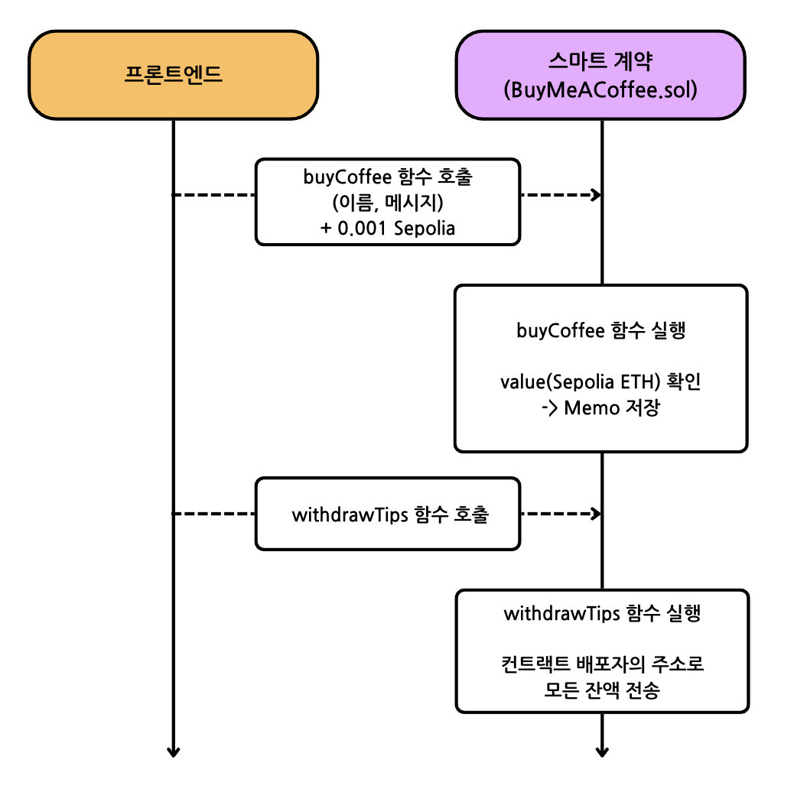

# Scaffold-ETH 2로 간단한 Payment 만들기 (Defi)

## 🚩 Step 0. DeFi란?

DeFi(Decentralized Finance, 탈중앙화 금융)은 은행과 같은 중앙 집중식 기관 없이 이용할 수 있는 다양한 금융 상품 및 서비스를 말한다.

기존 전통적 방식인 CeFi(Centralized Finance, 중앙화 금융)에서는 사용자가 대금을 송금하거나, 통화를 거래하거나, 대출을 받을 때 은행이나 중개인 같은 중앙화된 기관에 의존하게 된다. 이러한 기관은 편리한 인터페이스와 고객 지원을 제공하며, 문제가 발생할 경우 중앙 기관에서 지원을 받을 수 있으나, 반대로 생각해보면 중앙 기관에 문제가 생길 경우 이러한 지원이 어려워질 뿐만 아니라 개인 자산의 안전도 보장받을 수 없다.

반면 DeFi는 블록체인 기술을 기반으로 분산화된 네트워크에서 자동으로 운영되기 때문에 중개자가 필요 없으며, 스마트 계약 코드는 공개되어 누구나 검토할 수 있기 때문에 안전성과 신뢰성 두 가지를 모두 지킬 수 있다.

DeFi의 특징

- 신뢰 최소화:

  중개인 또는 은행이 관리하는 데이터베이스와 같은 중앙 집중식 데이터베이스 대신 블록체인 기술에 의존하므로 사용자는 불투명한 규칙을 지닌 거대 조직을 맹목적으로 신뢰할 필요가 없다.

- 허가 불필요: 
  
  암호화폐 지갑만 있으면 누구나 참여할 수 있으며, 재정적 자격이나 정부와 같은 기관의 승인이 필요하지 않다.


> 🔥 이번 미션에서는 간단한 DeFi 컨트랙트를 배포하여 데이터를 블록체인에 저장하고 지갑 안의 잔액을 다른 주소로 송금할 수 있는 웹앱 프론트엔드를 제작한다.

---

## 🚩 Step 1. 환경

프로젝트 클론해가기

```sh
git clone -b simple-payment --single-branch https://github.com/Ludium-Official/solidity-dapp-mission.git simple-payment
cd simple-payment
yarn install
```
---

### Op1) 로컬 환경에서 실행

```sh
# 로컬 블록체인 초기화
yarn chain

# 스마트 계약 배포
yarn deploy

# 프론트엔드 실행
yarn start
```

📱 http://localhost:3000 으로 접속해서 애플리케이션 열기

---

### Op2) 테스트넷 환경에서 실행

**🪪 배포자 (Deployer) 설정**

***방법 1. 배포자 주소를 생성하여 사용***

주소가 생성되면 니모닉은 로컬에 저장되고, 프라이빗 키를 따로 입력하지 않고 계약을 배포할 수 있다.

```sh
# 배포자 주소 생성
yarn generate

# 로컬 계정 잔액 확인
yarn account
```
위에서 생성된 주소로 sepoliaETH를 보내거나 공개 faucet에서 받는다.

***방법 2. 실제 소유한 주소를 사용***

`packages/hardhat/.env` 및 `packages/nextjs/.env.local`을 수정한다.

```bash
# .env
ALCHEMY_API_KEY=
DEPLOYER_PRIVATE_KEY=
```
본인 계정의 [Alchemy](https://dashboard.alchemy.com/apps) Apps API key와 소유하고 있는 지갑의 프라이빗 키를 기입한다.

> Metamask 지갑의 경우, 계정 세부 정보로 들어가면 프라이빗 키를 얻을 수 있다.

<br/>

**🪝 배포하기**

***방법 1. defaultNetwork 설정***
`packages/hardhat/hardhat.config.ts`에서 defaultNetwork를 `sepolia`로 변경한다.

```sh
yarn deploy
```

***방법 2. 명령에서 네트워크 지정***
```sh
yarn deploy --network sepolia
```

<br/>

**🏛️ 프론트엔드 배포하기**

`packages/nextjs/scaffold.config.ts`를 아래처럼 변경한다.

```typescript
const scaffoldConfig = {
  targetNetworks: [chains.sepolia],

  // ...

  onlyLocalBurnerWallet: false,
} as const satisfies ScaffoldConfig;
```

NestJS 애플리케이션을 배포한다. [Vercel](https://vercel.com/) 에서 로그인 후 dashboard로 이동해 `Add New -> Project` 를 클릭한 후 GitHub repository를 임포트해온다.

```shell
yarn vercel
```

📱 Vercel이 제공하는 url 로 접속해서 애플리케이션 열기

---

## 🚩 Step 2. Balance 송금

로컬 환경에서 실행한 경우 지난 번과 동일하게 오른쪽 상단의 `Grab funds from faucet` 버튼을 클릭해 로컬 지갑으로 자금을 보낸다.

테스트넷 환경에서 실행한 경우 실제 지갑이 보유하고 있는 자금을 확인할 수 있다.

<image src='./images/connect_sepolia.png' /> 

✏️ 'Home' 탭에서 **Name, Message** 를 입력한 후 `Send Message with Tips (0.001 ETH)` 버튼을 클릭한다.

<image src='./images/send_message.png' width='300px' /> 

컨트랙트 소유주에게 0.001 SepoliaETH 를 보낸다.

<image src='./images/send_tips.png' width='300px' />

트랜잭션이 완료되면 Message Board에 새로운 message가 생성되는 것을 볼 수 있다.

<image src='./images/message_board.png' width='500px' />

Debug Contracts 탭에서 BuyMeACoffee의 배포자 주소와 컨트랙트에 담겨있는 balance를 확인할 수 있다. 지금까지 받은 Tips의 총액을 알 수 있다.

<image src='./images/deployer.png' width='300px' />

withdrawTips 함수를 실행하면 위의 balance가 배포자의 주소로 송금된다.

`yarn account` 명령으로 배포자가 소유하고 있는 잔액을 확인할 수 있다.

<image src='./images/deployer_balance.png' width='400px' />

<br/>

🔏 packages/hardhat/contracts에서 스마트 계약 BuyMeACoffee.sol을 확인할 수 있다.

💼 packages/hardhat/deploy에서 배포 스크립트 00_deploy_your_contract.js를 확인할 수 있다.

📝 만약 프론트엔드를 수정하고 싶다면, `packages/nextjs/app` 로 이동해 원하는 특정 페이지를 열어 수정한다.

**[buyCoffee 함수 Sequence]**

</img>