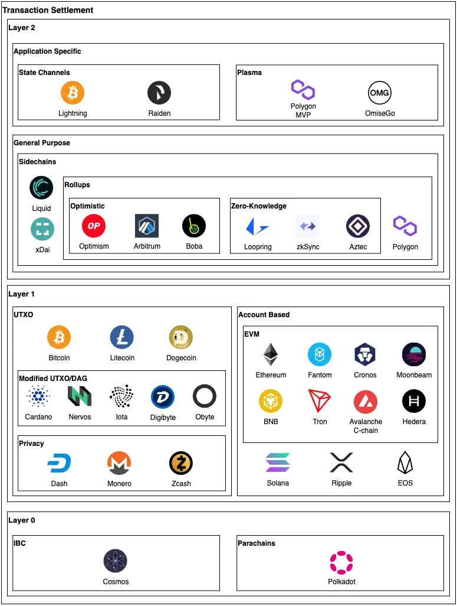
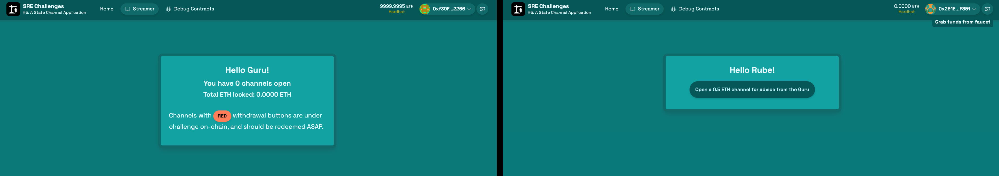
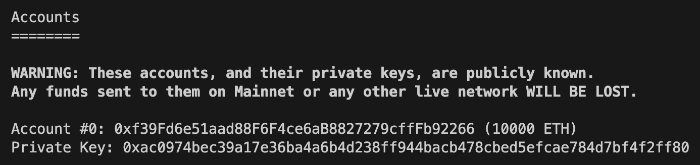
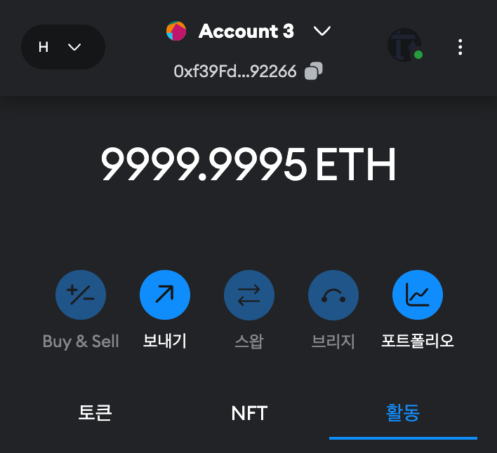
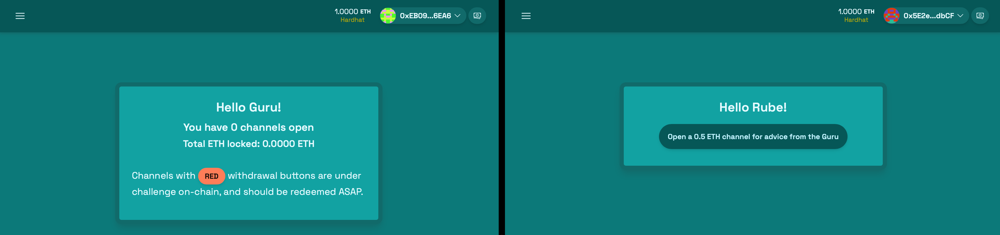
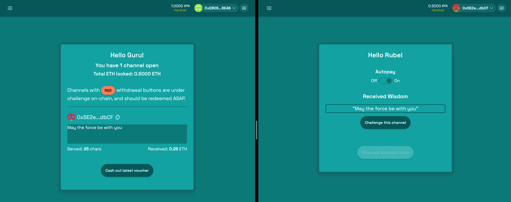
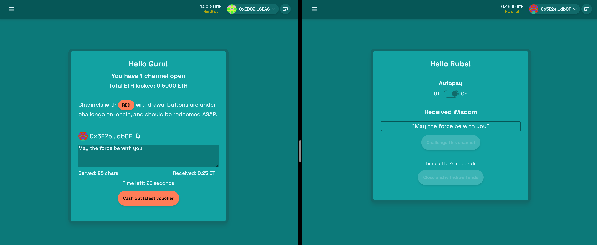
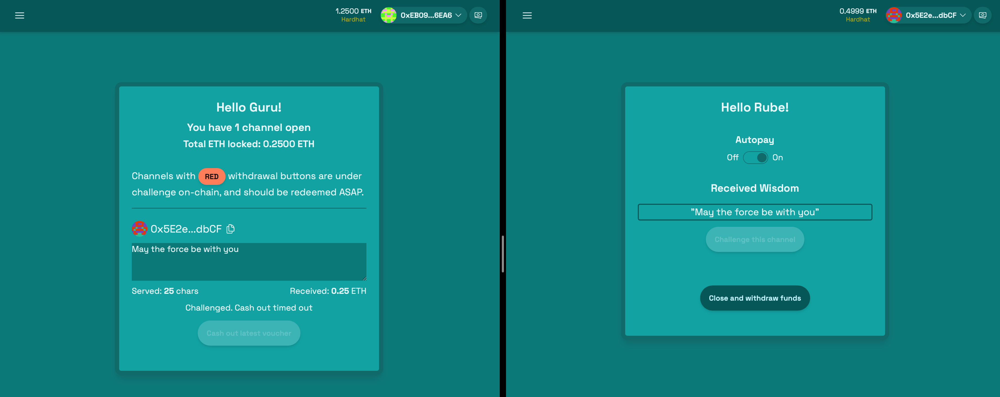
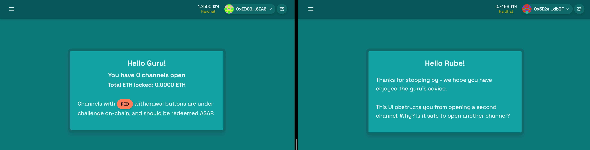

# Scaffold-ETH 2로 상태 채널 만들기

## 🚩 Step 0. 상태 채널

이전에 언급했듯이, 이더리움 블록체인은 뛰어난 탈중앙화 및 보안 속성을 가지고 있지만 거래 처리량이 낮고 비용이 비싸다는 고질적인 문제를 가지고 있다.

때문에 기존의 많은 웹 애플리케이션을 블록체인에서 실행하기 위해 사용하는 것이 L2 체인이다. L2 중에는 결제 채널, 상태 채널, 상태 채널 네트워크의 개념이 있다.



상태 채널은 고빈도로 서비스 대가를 교환하고자 하는 고정된 참가자 집합의 경우 확장 솔루션으로서 매우 뛰어나다. 정형적인 예는 파일 공유 또는 미디어 스트리밍이다.

우리의 경우, 서비스 제공자는 각 클라이언트에게 즉흥적인 지혜를 제공하며, 제공되는 각 텍스트 문자마다 0.01 ETH의 보상을 받는다.

> 🔥 이번 미션에서는 서비스 이용자가 한 번의 거래로 담보를 온체인에 잠그고, 서비스 제공자와의 상호작용을 완전히 오프체인에서 수행한 후, 두 번째 온체인 거래로 상호작용을 마무리하는 간단한 상태 채널 애플리케이션을 만든다.

---

## 🚩 Step 1. 환경

프로젝트 클론해가기

```sh
git clone -b state-channel --single-branch https://github.com/Ludium-Official/solidity-dapp-mission.git state-channel
cd state-channel
yarn install
```

<br/>

**🪪 배포자 (Deployer) 설정**

`packages/hardhat/.env` 및 `packages/nextjs/.env.local`을 수정한다.

```bash
# .env
ALCHEMY_API_KEY=
DEPLOYER_PRIVATE_KEY=
ARBISCAN_API_KEY=
```
본인 계정의 [Alchemy](https://dashboard.alchemy.com/apps) Apps API key와 소유하고 있는 지갑의 프라이빗 키, [Arbiscan](https://arbiscan.io/apis) API Key를 기입한다.

> Metamask 지갑의 경우, 계정 세부 정보로 들어가면 프라이빗 키를 얻을 수 있다.

<br/>

**🪝 컨트랙트 배포하기**

`packages/hardhat/hardhat.config.ts`에서 defaultNetwork를 `arbitrum`로 변경한다.

```sh
yarn deploy
```

<br/>

**🏛️ 프론트엔드 배포하기**

`packages/nextjs/scaffold.config.ts`를 아래처럼 변경한다.

```typescript
const scaffoldConfig = {
  targetNetworks: [chains.arbitrum],

  // ...

  onlyLocalBurnerWallet: false,
} as const satisfies ScaffoldConfig;
```

NestJS 애플리케이션을 배포한다. [Vercel](https://vercel.com/) 에서 로그인 후 dashboard로 이동해 `Add New -> Project` 를 클릭한 후 GitHub repository를 임포트해온다.

```shell
yarn vercel
```

📱 Vercel이 제공하는 url 로 접속해서 애플리케이션 열기

---

## 🚩 Step 2. 서비스 제공자 (Guru) & 서비스 사용자 (Rube) 세팅하기



### Op1) Arbitrum One에서 배포한 경우

각 3개의 브라우저 탭을 열어서 하나는 서비스 제공자 (Guru), 나머지는 서비스 사용자 (Rube)로 지갑을 연결한다.

만약 배포자 계정과 컨트랙트 소유자 계정을 다르게 세팅하고 싶다면, `packages/hardhat/deploy/00_deploy_streamer.ts` 에서 아래와 같이 주석을 해제하고 컨트랙트를 소유할 계정의 주소를 넣어 재배포한다.

```solidity
import { Streamer } from "../typechain-types";

const streamer: Streamer = await hre.ethers.getContract("Streamer", deployer);

// Transfer ownership to your front end address
console.log("\n 🤹  Sending ownership to frontend address...\n");
const ownerTx = await streamer.transferOwnership("** 컨트랙트 소유할 계정 주소 **");
console.log("\n       confirming...\n");
const ownershipResult = await ownerTx.wait();
if (ownershipResult) {
  console.log("       ✅ ownership transferred successfully!\n");
}
```

```sh
yarn deploy --reset
```

### Op2) 로컬 환경에서 배포한 경우

로컬 환경에서 배포한 경우 `yarn chain`으로 초기화 된 블록체인에서 제공하는 가상 계정 중 첫 번째 계정이 배포자가 된다.

메타마스크에서 `계정 추가 -> 계정 가져오기 -> 비공개 키 입력` 으로 배포자 계정을 추가한 후 브라우저 우측 상단의 지갑을 메타마스크 계정으로 변경한다.




또는, 브라우저에서 연결된 burner 지갑의 주소로 컨트랙트 소유를 이전하여 재배포한다.

`packages/hardhat/deploy/00_deploy_streamer.ts` 수정 및 `yarn deploy --reset`

---

## 🚩 Step 3. 서비스 교환

**(1) 채널 열기**

Rube 페이지에서 `Open a 0.5 ETH channel for advice from the Guru` 버튼을 클릭하여 채널을 연다.



0.5 ETH 를 지불하고 fundChannel() 함수를 호출한다.

```solidity
// 채널 펀딩
function fundChannel() public payable {
  // msg.sender가 이미 채널을 운영하고 있는지 확인
  require(balances[msg.sender] == 0, "Channel already funded");
  balances[msg.sender] = msg.value;
  emit Opened(msg.sender, msg.value);
}
```

**(2) 지혜 전달**

Guru 페이지에서 채널의 사용자에게 지혜를 전달한다.



(`packages/nextjs/app/streamer/_components/Guru.tsx`의 `providerService()` 함수 참고)

사용자가 보낸 금액의 한도 내에서 Guru가 작성한 지혜의 글자만큼 ETH를 설정한다.

이 때, Rube 페이지에서 Autopay가 On으로 설정되어 있다면, `packages/nextjs/app/streamer/_components/Rube.tsx`의 `reimburseService`가 실행되어, Guru에게 voucher를 전송한다.

이는 추후 서비스 제공자가 수익을 인출할 때 확인용으로 사용된다.


**(3) 서비스 제공자 수익 인출**

Guru 페이지의 `Cash out latest voucher` 버튼을 클릭하여 서비스 제공자의 지갑으로 ETH를 전송한다.



`withdrawEarnings()` 함수를 실행해 위에서 받은 voucher로 서명을 검증 한 후 잔액을 업데이트 한 후 서비스 제공자에게 전송한다.

```solidity
// 서비스 제공자가 수익을 인출
function withdrawEarnings(Voucher calldata voucher) public onlyOwner() {
  // 오프체인 코드와 마찬가지로, 서명은 데이터 원본이 아닌 해시로 적용
  bytes32 hashed = keccak256(abi.encode(voucher.updatedBalance));

  // 이더리움 오프체인 메시지 서명 및 검증에 사용되는 관례의 일부
  // 뒤에 오는 32는 첨부된 해시 메시지의 32 바이트 길이를 나타냄
  bytes memory prefixed = abi.encodePacked("\x19Ethereum Signed Message:\n32", hashed);
  bytes32 prefixedHashed = keccak256(prefixed);

  // 서명 검증, 서명이 유효한지 확인
  address signer = ecrecover(prefixedHashed, voucher.sig.v, voucher.sig.r, voucher.sig.s);
  require(balances[signer] > voucher.updatedBalance, "Invalid balance update");

  // 잔액 업데이트
  uint256 payment = balances[signer] - voucher.updatedBalance;
  balances[signer] = voucher.updatedBalance;

  payable(owner()).transfer(payment); // 서비스 제공자에게 수익 전송
  emit Withdrawn(signer, payment);
}
```

**(4) 채널을 도전 상태로 변경**

만약 Rube가 Guru의 서비스에 만족하지 못하다면, 남은 자금을 돌려받을 수 있다.

결제 채널은 암호 경제 프로토콜로서, 모든 참여자의 재정이 보호되도록 작성되어야 한다. Rube에게 남은 자금을 회수해보자.

Rube 페이지에서 `Challenge this channel` 버튼을 클릭하여 정해진 기간 후에 채널이 닫히도록 설정한다.



도전 기간은 스마트 계약에서 지정한대로 `challengeChannel()` 함수가 호출된 시점에서 1일간 지속된다.

```solidity
// 채널을 도전 상태로 변경
function challengeChannel() public {
  require(balances[msg.sender] > 0, "No open channel");
  canCloseAt[msg.sender] = block.timestamp + 1 days; // 현재 시간부터 1일동안
  emit Challenged(msg.sender);
}
```

채널이 도전 상태로 변경됨과 동시에 Guru에게도 채널이 닫힐 것을 알린다. Guru는 도전 기간이 끝나기 전까지 잔액을 인출할 수 있다.

**(5) 채널 닫기**

도전 기간이 끝난 뒤 `Close and withdraw funds` 버튼을 클릭하여, 채널을 닫고 남은 자금을 회수한다.



---

**[State Channel Sequence]**

