# Scaffold-ETH 2로 간단한 Token Vendor 만들기 (ERC20)

## 🚩 Step 0. ERC20 토큰

스마트 계약은 누구나 접근할 수 있는 "항상 켜져 있는" 자판기와 같다. 자판기는 언제나 작동 중이며, 사용자가 적절한 금액을 투입(특정 조건을 충족)하면 원하는 상품을 제공한다.

ERC20 스마트 계약의 구체적인 기능으로는 토큰 전송(Transfer), 잔액 조회(BalanceOf), 토큰 승인(Approve) 및 위임된 전송(TransferFrom)이 있다.

***토큰 전송***은 사용자가 자신의 주소에서 다른 주소로 토큰을 전송하는 것으로, 자판기에 비유하자면 사용자가 돈을 넣고 원하는 상품(토큰)을 선택하여 다른 사람에게 주는 것과 같다.

***잔액 조회***는 특정 주소가 보유한 토큰 잔액을 조회하는 것이다. 사용자가 자판기에 넣은 돈의 총액을 확인하는 것과 유사하다.

***토큰 승인과 위임된 전송***은 사용자가 다른 주소에게 특정 양의 토큰을 대신 전송할 수 있는 권한을 부여하는 것이다. 사용자가 다른 사람에게 자판기에서 특정 금액의 상품을 뽑을 수 있도록 허락하는 것과 같다.

> 🔥 이번 미션에서는 디지털 화폐를 만드는 ERC20 컨트랙트와, 그 화폐를 사고 팔 수 있는 컨트랙트를 배포해 상시 작동하는 디지털 화폐 자판기 웹앱 프론트엔드를 제작한다.

---

## 🚩 Step 1. 환경

프로젝트 클론해가기

```sh
git clone -b token-vendor --single-branch https://github.com/Ludium-Official/solidity-dapp-mission.git token-vendor
cd token-vendor
yarn install
```
---

### Op1) 로컬 환경에서 실행

```sh
# 로컬 블록체인 초기화
yarn chain

# 스마트 계약 배포
yarn deploy

# 프론트엔드 실행
yarn start
```

📱 http://localhost:3000 으로 접속해서 애플리케이션 열기

---

### Op2) 테스트넷 환경에서 실행

**🪪 배포자 (Deployer) 설정**

***방법 1. 배포자 주소를 생성하여 사용***

주소가 생성되면 니모닉은 로컬에 저장되고, 프라이빗 키를 따로 입력하지 않고 계약을 배포할 수 있다.

```sh
# 배포자 주소 생성
yarn generate

# 로컬 계정 잔액 확인
yarn account
```
위에서 생성된 주소로 sepoliaETH를 보내거나 공개 faucet에서 받는다.

***방법 2. 실제 소유한 주소를 사용***

`packages/hardhat/.env` 및 `packages/nextjs/.env.local`을 수정한다.

```bash
# .env
ALCHEMY_API_KEY=
DEPLOYER_PRIVATE_KEY=
```
본인 계정의 [Alchemy](https://dashboard.alchemy.com/apps) Apps API key와 소유하고 있는 지갑의 프라이빗 키를 기입한다.

> Metamask 지갑의 경우, 계정 세부 정보로 들어가면 프라이빗 키를 얻을 수 있다.

<br/>

**🪝 배포하기**

***방법 1. defaultNetwork 설정***
`packages/hardhat/hardhat.config.ts`에서 defaultNetwork를 `sepolia`로 변경한다.

```sh
yarn deploy
```

***방법 2. 명령에서 네트워크 지정***
```sh
yarn deploy --network sepolia
```

<br/>

**🏛️ 프론트엔드 배포하기**

`packages/nextjs/scaffold.config.ts`를 아래처럼 변경한다.

```typescript
const scaffoldConfig = {
  targetNetworks: [chains.sepolia],

  // ...

  onlyLocalBurnerWallet: false,
} as const satisfies ScaffoldConfig;
```

NestJS 애플리케이션을 배포한다. [Vercel](https://vercel.com/) 에서 로그인 후 dashboard로 이동해 `Add New -> Project` 를 클릭한 후 GitHub repository를 임포트해온다.

```shell
yarn vercel
```

📱 Vercel이 제공하는 url 로 접속해서 애플리케이션 열기

---

## 🚩 Step 2. 민팅(Minting)

가장 먼저, 페이지 우측 상단의 연결된 지갑 주소를 `YourToken.sol`에 입력하여 `1000 GLD`를 민팅 받는다.

```solidity
contract YourToken is ERC20 {

  // 생성과 동시에 본인 지갑으로 토큰 1000개 민팅
  constructor() ERC20("Gold", "GLD") {
    _mint("내 지갑 주소", 1000 * 10 ** decimals());
  }
}
```

## 🚩 Step 3. 전송(Transfer) / 잔액 조회(BalanceOf)

`Debug Contracts` 탭에서 해당 지갑 주소로 balanceOf()를 확인하여 1000개가 민팅 되었는지 확인 해본다.

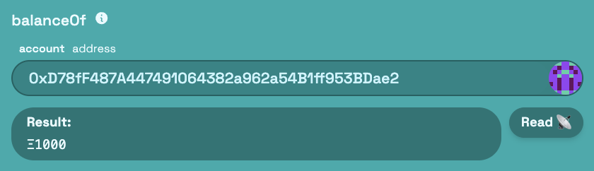</img>

새로운 시크릿 창을 열어 새로운 계정으로 토큰을 전송해본다.

> ❗️주의: Wei 단위로 입력해야 한다.<br/>
  (ex. 10 GLD == 10 * (10 ** 18) == 10000000000000000000 WEI)

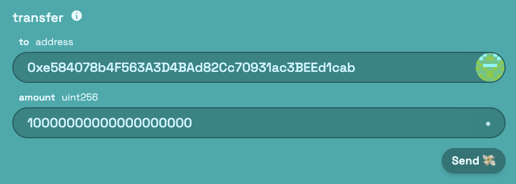</img>

새로운 계정에서 토큰을 전송받은 것을 확인 해볼 수 있다.

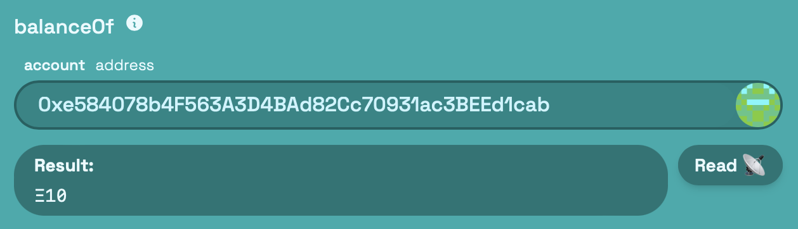</img>

`Token Vendor` 탭에서 `Transfer tokens`를 실행하는 경우, 자동으로 단위를 변경하여 전송한다.

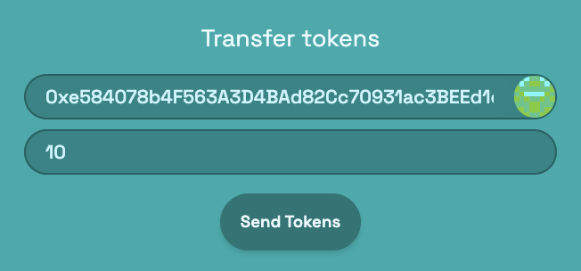</img>

## 🚩 Step 4. 토큰 승인(Approve) / 위임된 전송(TransferFrom)

이번에는 다시 `YourToken.sol`을 배포자의 주소로 토큰을 민팅받을 수 있게 수정한 후 재배포한다.

```solidity
contract YourToken is ERC20 {

  // 생성과 동시에 배포자에게 토큰 1000개 민팅
  constructor() ERC20("Gold", "GLD") {
    _mint(msg.sender, 1000 * 10 ** decimals());
  }
}
```

```sh
yarn deploy --reset
```

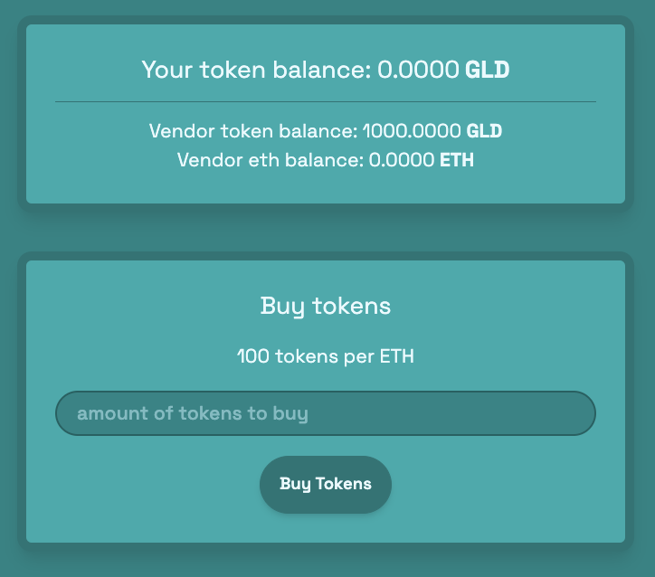</img>

Vendor(배포자)가 민팅된 토큰 1000개를 가지고 있는 것을 확인할 수 있다.

오른쪽 상단의 `Grab funds from faucet` 버튼을 클릭해 로컬 지갑으로 자금을 보낸 후 토큰을 구매해보자.

> 💰 100 GLD == 1 ETH

구매하고자 하는 토큰의 수량을 입력하고 `Buy Tokens` 버튼을 클릭한다.

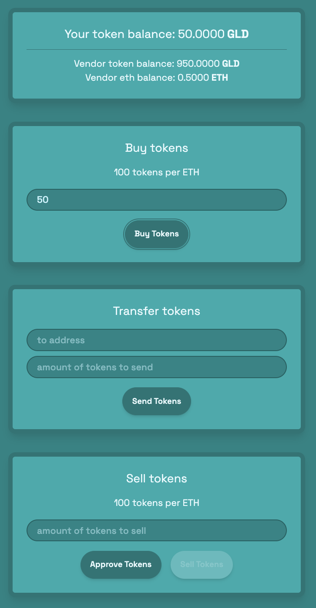</img>

내가 구매한 토큰의 개수와 Vendor(배포자)가 가지고 있는 토큰/ETH 개수를 확인할 수 있다.

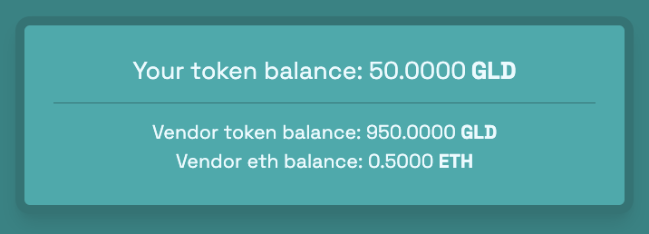</img>

새로운 시크릿 창을 열어 새로운 계정으로 토큰을 전송해본다.

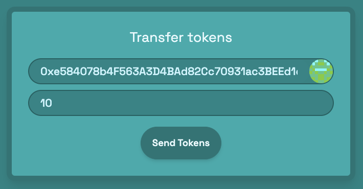</img>

새로운 계정에서 받은 토큰을 확인할 수 있다.

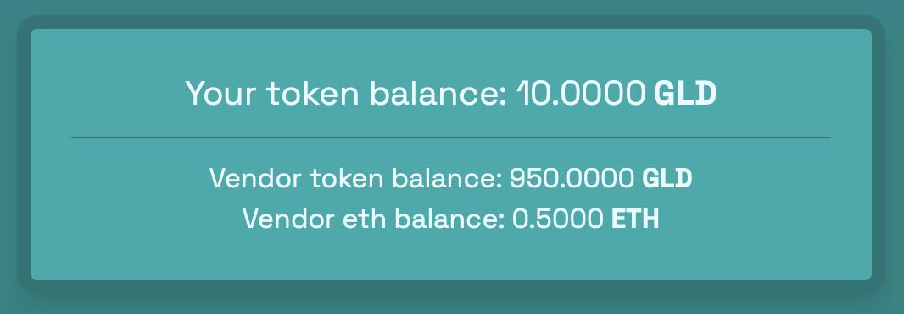</img>

이번에는 가지고 있는 토큰을 팔아서 ETH를 받아보자.

토큰을 판매는 구매와 다르게 ERC20 표준에 정의된 `approve()`함수와 `transferFrom()`함수가 사용된다. 이 함수들은 토큰 소유자가 자신의 토큰을 다른 주소가 대신 전송할 수 있도록 허락하는 메커니즘을 제공한다.

팔고싶은 토큰의 수량을 입력하고 `Approve Tokens` 버튼을 클릭한다.
 
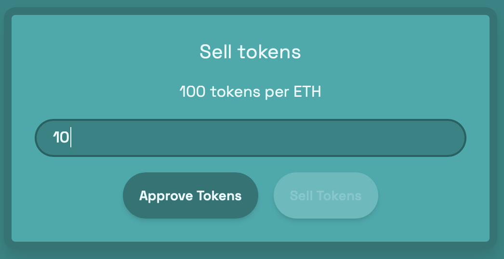</img>

트랜잭션이 성공하면 10만큼의 토큰에 대한 권한이 Vendor에게 부여된다.

`Sell Tokens` 버튼을 클릭하면, 내가 가지고 있는 토큰이 Vendor Contract로 전송되고 ETH를 받는다.

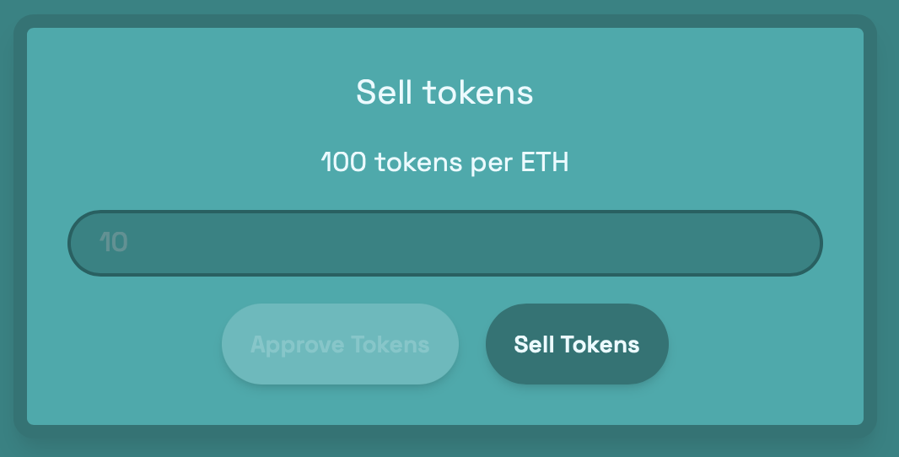</img>

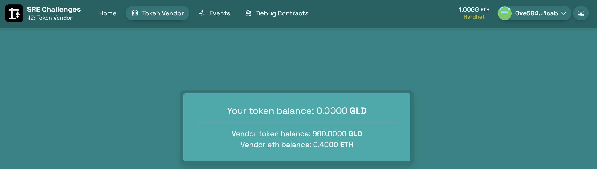</img>

**[Approve & TransferFrom Sequence]**

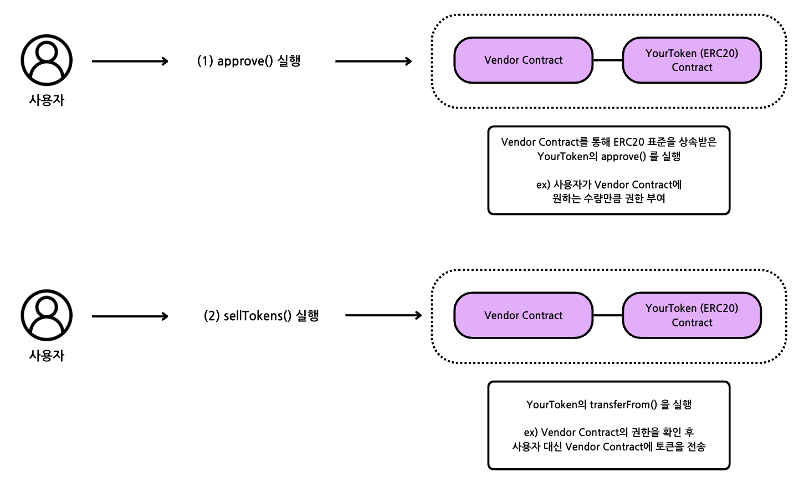</img>


```solidity
// ERC20.sol

// 트랜잭션 실행자(토큰 보유자)가 spender에게 amount만큼의 토큰을 대신 전송할 수 있는 권한 부여
function approve(address spender, uint256 amount) public virtual override returns (bool) {
    address owner = _msgSender();
    _approve(owner, spender, amount);
    return true;
}

// 권한 부여 확인 후 토큰 전송
function transferFrom(address from, address to, uint256 amount) public virtual override returns (bool) {
    address spender = _msgSender();
    _spendAllowance(from, spender, amount);
    _transfer(from, to, amount);
    return true;
}
```

토큰을 사고 팔면서 발생한 이벤트는 `Events` 탭에서 확인할 수 있다.

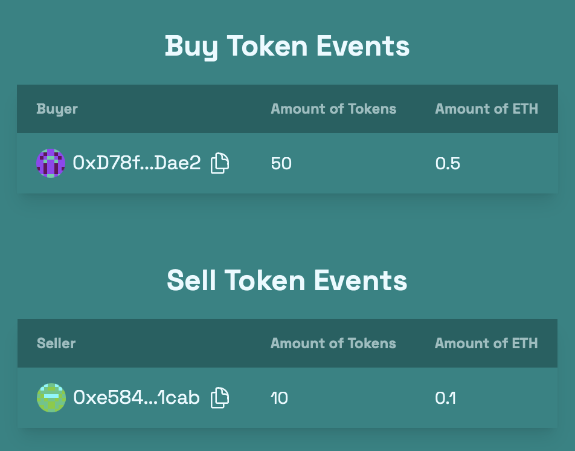</img>