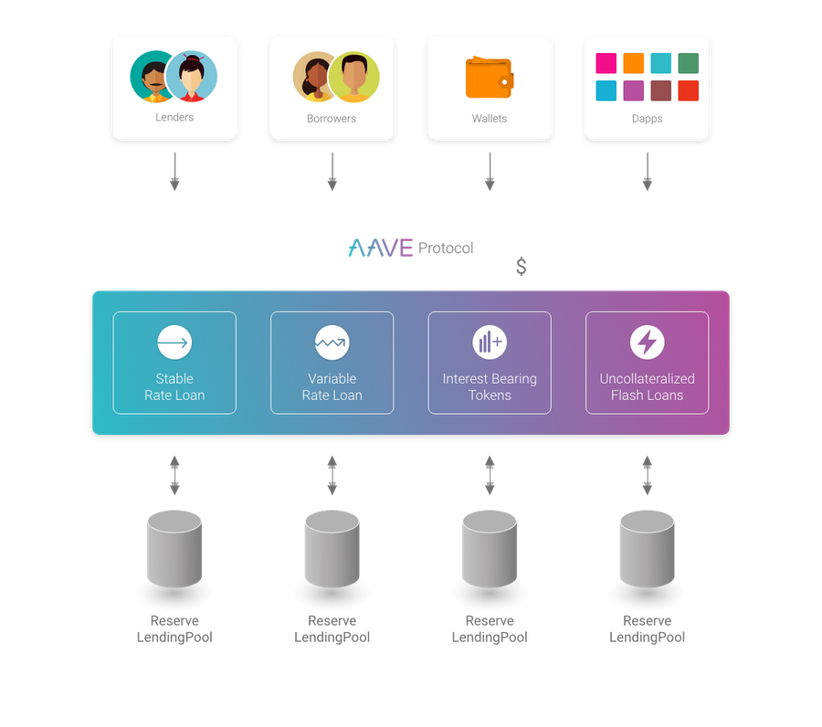
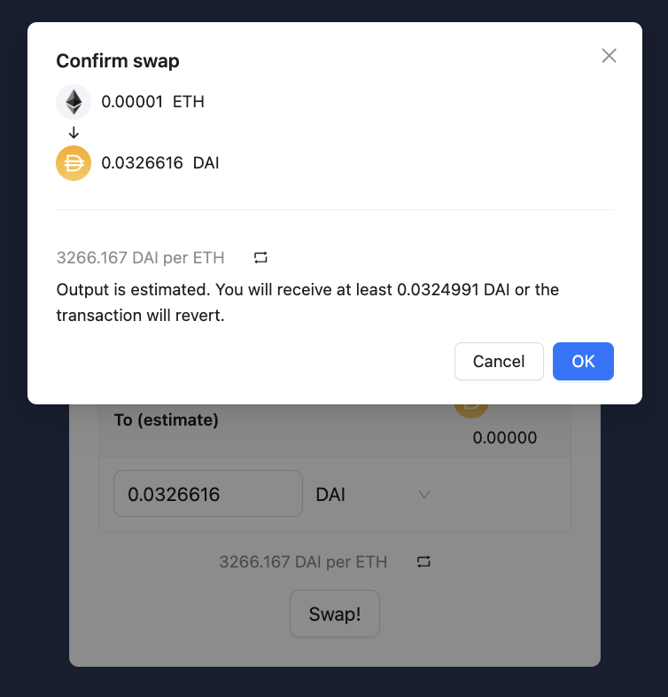
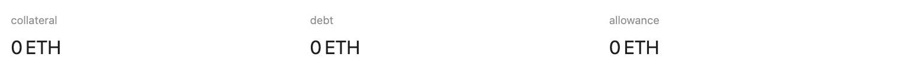
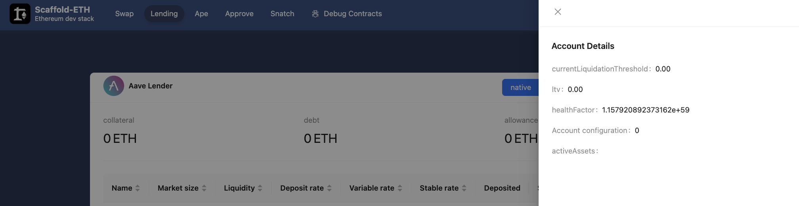
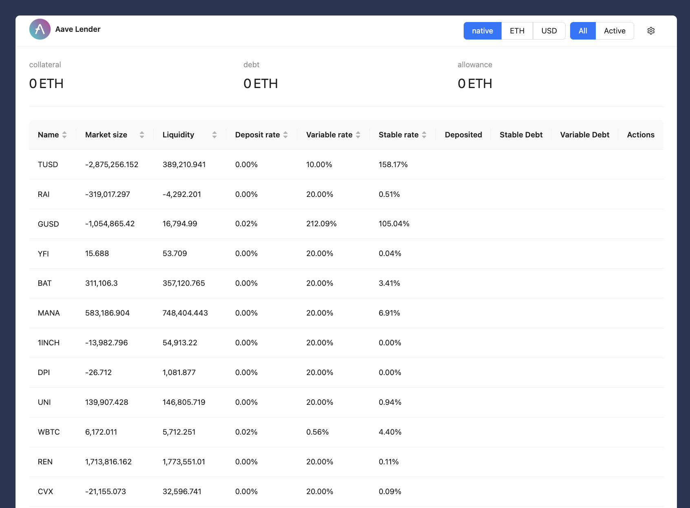
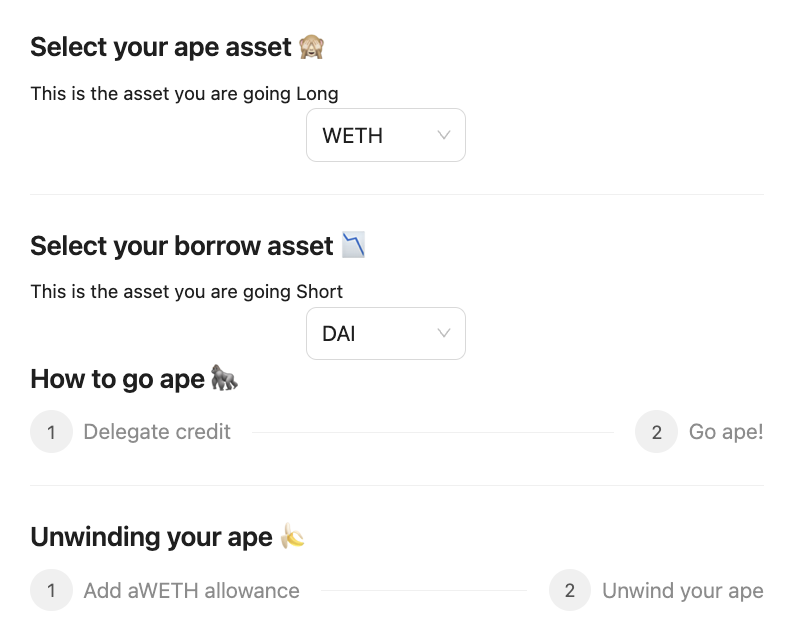

# Scaffold-ETH 2로 Aave 대출 디앱 만들기

## 🚩 Step 0. Aave Protocol

Aave는 사용자들이 공급자 또는 차용자로 참여할 수 있는 탈중앙화 비수탁 유동성 시장 프로토콜이다. 공급자들은 시장에 유동성을 제공하여 수동적인 수익을 얻을 수 있으며, 차용자들은 초과 담보(영구적) 또는 미달 담보(1블록 유동성) 방식으로 자금을 빌릴 수 있다.

만약 Aave에서 대출을 받고 싶다면 다른 자산에 그 이상의 담보를 제공해야한다. 이렇게 하면 차용자가 대출을 갚을 수 없거나 빌린 자산의 가치가 떨어졌을 경우 프로토콜이 충분한 자금을 확보하고 있기 때문에 대출자의 자산을 안전하게 지킬 수 있다.



<br/>

**[Aave 대출 디앱에서 사용하는 스마트 계약 일부 Preview]**

- [LendingPool](https://docs.aave.com/developers/core-contracts/pool) : 입금 및 대출이 이루어지는 곳 🏦

    - write methods
        - supply(): 사용자가 자산을 Pool에 예치
        - withdraw(): 사용자가 예치한 자산을 인출
        - borrow(): 사용자가 담보를 제공하고 자산을 대출
        - repay(): 사용자가 대출받은 자산을 상환
        - liquidationCall(): 담보 비율이 부족한 사용자의 자산을 청산
    
    - view methods
        - getUserAccountData(): 사용자의 계정 데이터 반환
        - getUserConfiguration(): 특정 사용자가 Aave 프로토콜에서 어떤 자산을 예치하거나 차입했는지에 대한 구성 데이터를 반환

- [ProtocolDataProvider](https://docs.aave.com/developers/core-contracts/aaveprotocoldataprovider) : 대출, 차입, 유동성 등 다양한 풀 관련 데이터를 외부에서 조회할 수 있도록 하는 곳 📊

	- getUserReserveData(): 특정 사용자의 자산별 풀 데이터 반환
    - getUserAccountData(): 특정 사용자의 전체 계정 상태 반환
    - getAllReservesTokens(): Aave 프로토콜에서 지원하는 모든 리저브 토큰(예치된 자산)의 정보를 반환
    - getReserveData(): 특정 자산의 풀 데이터(유동성, 대출/차입 금리, 총 공급량 등)를 반환
    - getReserveConfigurationData(): 특정 자산의 설정 데이터(LTV, 청산 임계값, 보너스 등)를 반환


<br/>

> 🔥 이번 미션에서는 Aave 프로토콜 V2를 사용하여 사용자가 자유롭게 자산을 공급하고 대출받을 수 있는 웹앱 프론트엔드를 제작한다.

---

## 🚩 Step 1. 환경

프로젝트 클론해가기

```sh
git clone -b lending --single-branch https://github.com/Ludium-Official/solidity-dapp-mission.git lending
cd lending
yarn install
```
---

**🪪 배포자 (Deployer) 설정**

이번 프로젝트에서는 Aave protocol과 호환되는 network를 사용한다.

✅ [Mainnet 리스트](https://docs.aave.com/developers/v/2.0/deployed-contracts/deployed-contracts)

✅ [테스트넷 리스트](https://docs.aave.com/developers/deployed-contracts/v3-testnet-addresses)

`packages/hardhat/deploy/00_deploy_your_contract.ts` 에서 아래 컨트랙트 주소를 네트워크에 맞게 변경해준다.

```typescript
lendingPoolAddressesProvider: "0x012bAC54348C0E635dCAc9D5FB99f06F24136C9A"
```

✅ [Uniswap V2Router02 Contract Address](https://docs.uniswap.org/contracts/v2/reference/smart-contracts/v2-deployments)

위의 리스트에서 네트워크에 맞는 router contract address를 복사하고,

`packages/hardhat/deploy/00_deploy_your_contracts.ts` 의 uniswapRouterAddress 를 변경한다.

```typescript
uniswapRouterAddress: "0x7a250d5630B4cF539739dF2C5dAcb4c659F2488D"
```


---

***방법 1. 배포자 주소를 생성하여 사용***

주소가 생성되면 니모닉은 로컬에 저장되고, 프라이빗 키를 따로 입력하지 않고 계약을 배포할 수 있다.

```sh
# 배포자 주소 생성
yarn generate

# 로컬 계정 잔액 확인
yarn account
```
위에서 생성된 주소로 sepoliaETH를 보내거나 공개 faucet에서 받는다.

***방법 2. 실제 소유한 주소를 사용***

`packages/hardhat/.env` 및 `packages/nextjs/.env.local`을 수정한다.

```bash
# .env
ALCHEMY_API_KEY=
DEPLOYER_PRIVATE_KEY=
```
본인 계정의 [Alchemy](https://dashboard.alchemy.com/apps) Apps API key와 소유하고 있는 지갑의 프라이빗 키를 기입한다.

> Metamask 지갑의 경우, 계정 세부 정보로 들어가면 프라이빗 키를 얻을 수 있다.

<br/>

**🪝 배포하기**

***방법 1. defaultNetwork 설정***

`packages/hardhat/hardhat.config.ts`에서 defaultNetwork를 변경한 후 배포한다.

```sh
yarn deploy
```

***방법 2. 명령에서 네트워크 지정***
```sh
yarn deploy --network [지정 네트워크]
```

<br/>

**🏛️ 프론트엔드 배포하기**

1. `packages/nextjs/scaffold.config.ts`를 변경한다.

    ```typescript
    const scaffoldConfig = {
    targetNetworks: [chains.지정 네트워크],

    // ...

    onlyLocalBurnerWallet: false,
    } as const satisfies ScaffoldConfig;
    ```

2. `packages/nexts` 루트에 .env.local 파일을 생성하고, infura id를 넣어준다.


    ```env
    NEXT_PUBLIC_INFURA_ID=
    ```

---

## 🚩 Step 2. 백엔드 서버 실행

새 터미널을 열어서 백엔드 서버를 실행한다.

```bash
node packages/backend/index.js
```

---

## 🚩 Step 3. Swap

> 👀 시작하기에 앞서...<br/> 본 프로젝트는 Aave Protocol V2 를 기반으로 작성되었으나, V2 에서 호환되는 테스트 네트워크인 kovan과 goerli가 deprecated 되었기 때문에 테스트넷에 한하여 V3 contract address를 사용한다. <br/>

`Swap` 탭에서 Uniswap V2 Router 로 해당 network에 있는 토큰을 swap 할 수 있다. 

✅ [Uniswap V2Router02 Contract Address](https://docs.uniswap.org/contracts/v2/reference/smart-contracts/v2-deployments)

위의 리스트에서 배포한 네트워크의 router contract address를 복사하고,

`packages/nextjs/components/aave/Swap.jsx` 의 ROUTER_ADDRESS 에 변경하여 적용한다.

```javascript
export const ROUTER_ADDRESS = '0x7a250d5630B4cF539739dF2C5dAcb4c659F2488D'
```

Swap 하고자하는 토큰 2개를 선택하고 수량을 입력하면 실시간 가격이 계산되고, `Swap!` 버튼을 클릭하면 모든 조건이 부합할 경우 swap이 성공한다.



> ⚠️ 우리 디앱에서는 Mainnet의 경우에만 swap이 가능하다.

---

## 🚩 Step 4. Lend

`Lend` 탭에서는 사용자의 계정과 자산 관련 정보를 실시간으로 확인하고, 
Aave 프로토콜과 상호작용하여 예치, 인출, 차입, 상환, 담보 관리 등의 주요 DeFi 기능을 수행할 수 있다.

Aave graphql을 사용하기 위해 [Aave Protocol Subgraphs](https://github.com/aave/protocol-subgraphs)에서 해당 네트워크의 query url을 복사해 `packages/nextjs/app/apollo-wrapper.jsx`를 수정한다.

> ⚠️ Testnet subgraph는 현재 사용이 중지된 것으로 보인다.

```javascript
uri: `https://gateway-arbitrum.network.thegraph.com/api/${thegraph_api_key}/subgraphs/id/Cd2gEDVeqnjBn1hSeqFMitw8Q1iiyV9FYUZkLNRcL87g`,
```

`.env.local` 에서도 TheGraph api key를 기입한다.

```env
NEXT_PUBLIC_THEGRAPH_API=
```

---

1. 사용자 계정 정보 확인

	- 사용자의 담보 총액, 차입 총액, 대출 가능 금액

        

    - 사용자의 청산 임계값, 대출 비율, 포트폴리오 건강도, 사용자 계정의 구성 상태, 예치하거나 차입 중인 자산 목록

        

        - currentLiquidationThreshold (청산 임계값): 사용자가 예치한 담보 자산이 차입한 자산의 가치에 비해 얼마나 감소할 수 있는지
        - ltv (Loan-to-value, 대출 비율): 사용자가 차입할 수 있는 최대 자산의 비율
        - healthFactor (포트폴리오 건강도): 사용자의 담보 상태와 부채 상태를 평가하는 지표
        - Account configuration (사용자 계정의 구성 상태)
        - activeAssets (예치하거나 차입 중인 자산 목록)

2. 자산 관련 정보 확인

	- Market Size: 각 자산의 유동성 풀의 전체 규모
    - Liquidity: 차입자에게 제공할 수 있는 자산의 양
	- Deposit Rate: 각 자산의 예치 이자율
	- Variable Rate: 변동 이자율로 차입할 때 적용되는 이자율 확인
	- Stable Rate: 고정 이자율로 차입할 때 적용되는 이자율 확인
	- Deposited: 사용자가 각 자산에 대해 예치한 금액
	- Stable Debt: 고정 이자율로 차입한 부채 확인
	- Variable Debt: 변동 이자율로 차입한 부채 확인

        

3. Aave 프로토콜과 상호작용

	- deposit (예치): 자산이 현재 활성화되어 있는 경우, 사용자는 이 자산을 Aave 프로토콜에 예치할 수 있다.
	- withdraw (인출): 사용자가 예치한 자산이 있다면, 그 중 담보로 설정된 자산에 대해 인출할 수 있는 옵션을 제공한다.
	- borrow (차입): 자산이 대출 가능한 상태이고, 사용자의 대출 가능 금액 (allowance) 이 0보다 많으면 담보 자산을 기반으로 자산을 차입할 수 있다.
	- repay (상환): 사용자가 이미 차입한 자산을 상환할 수 있다.

        

---

## 🚩 Step 5. Ape

`Ape` 탭에서는 사용자가 자산을 빌려(Long position), 다른 자산으로 차입(Short position)하고, 차입한 자산을 Aave에 예치하거나, 이후 이 전략을 청산, 또는 “unwind”할 수 있도록 하는 기능을 제공한다. 

`packages/hardhat/contracts/AaveApe.sol` 스마트 계약과 함께 살펴보자.

만약 사용자의 대출 가능 금액이 0보다 많으면 아래와 같은 화면을 볼 수 있다.



<br/>

**[Ape 과정]**

1. AaveApe 스마트 계약이 사용자 대신 Aave 프로토콜에서 차입을 진행하기 때문에, 필요한 신용을 AaveApe 컨트랙트에 위임해야 한다.

    만약 사용자가 해당 자산에 대해 일정 이상의 크레딧을 위임하지 않은 상태면, `Delegate!` 버튼을 클릭해 위임하게 하고, 위임된 상태라면 다음 단계로 넘어간다.

2. 사용자가 WETH를 Long 포지션으로, DAI를 Short 포지션으로 선택한 상태에서 `Go Ape` 버튼을 클릭해 ape 함수를 호출한다.

    ape 함수는 Aave 프로토콜에서 사용자가 차입할 수 있는 최대 DAI 양을 계산하고, 이 금액을 Aave에서 차입한다.

3. 차입한 DAI를 Uniswap을 통해 WETH로 스왑하고, 스왑한 WETH는 다시 Aave 프로토콜에 예치한다.

```solidity
  function ape(address apeAsset, address borrowAsset, uint256 interestRateMode) public returns (bool) {

      // Aave 프로토콜에서 사용자가 차입할 수 있는 최대 DAI 양을 계산
      uint256 borrowAmount = getAvailableBorrowInAsset(borrowAsset, msg.sender);

      require(borrowAmount > 0, "Requires credit on Aave!");

      ILendingPool _lendingPool = LENDING_POOL();

      // Aave에서 해당 양만큼 차입
      _lendingPool.borrow(
        borrowAsset,
        borrowAmount,
        interestRateMode,
        0,
        msg.sender
      );

      // 빌린 자산을 Uniswap Router를 통해 권한 위임
      IERC20(borrowAsset).approve(UNISWAP_ROUTER_ADDRESS, borrowAmount);

      // Uniswap에서 차입한 자산을 다른 자산으로 교환
      address[] memory path = new address[](2);
      path[0] = borrowAsset;
      path[1] = apeAsset;

      uint[] memory amounts = UNISWAP_ROUTER.swapExactTokensForTokens(borrowAmount, 0, path, address(this), block.timestamp + 5);

      // 교환된 자산은 다시 Aave 프로토콜에 예치
      uint outputAmount = amounts[amounts.length - 1];
      IERC20(apeAsset).approve(ADDRESSES_PROVIDER.getLendingPool(), outputAmount);

      _lendingPool.deposit(
        apeAsset,
        outputAmount,
        msg.sender,
        0
      );

      emit Ape(msg.sender, 'open', apeAsset, borrowAsset, borrowAmount, outputAmount, interestRateMode);

      return true;
  }
```

**[Unwind 과정]**

1. 사용자가 차입한 자산을 상환하고, 예치된 자산을 인출한 뒤 교환하여 원래 상태로 되돌리기 위해서는 사용자가 Aave 프로토콜에서 aToken에 대해 충분한 허용량(Allowance)을 제공해야 한다.

    `Allow on the aToken!`을 클릭해 aToken에 대한 approve를 수행한다.

2. `Unwind Ape` 버튼을 클릭해 unwindApe 함수를 호출한다.

    unwindApe 함수는 Aave에서 플래시 론을 사용하여 사용자가 차입한 자산(예: DAI)을 상환하고, 예치한 자산(예: WETH)을 인출하여 포지션을 청산한다.

```solidity
  function unwindApe(address apeAsset, address borrowAsset, uint256 interestRateMode) public {

    // 사용자의 부채 확인
    (,uint256 stableDebt, uint256 variableDebt,,,,,,) = getProtocolDataProvider().getUserReserveData(borrowAsset, msg.sender);

    // 상환할 금액 결정
    uint256 repayAmount;
    if(interestRateMode == 1) {
      repayAmount = stableDebt;
    } else if (interestRateMode == 2) {
      repayAmount = variableDebt;
    }

    require(repayAmount > 0, "Requires debt on Aave!");

    // 플래시 론 준비
    address receiverAddress = address(this);

    address[] memory assets = new address[](1);
    assets[0] = borrowAsset;

    uint256[] memory amounts = new uint256[](1);
    amounts[0] = repayAmount;

    // 0 = no debt, 1 = stable, 2 = variable
    uint256[] memory modes = new uint256[](1);
    modes[0] = 0;

    address onBehalfOf = address(this);
    bytes memory params = abi.encode(msg.sender, apeAsset, interestRateMode);
    uint16 referralCode = 0;

    // 플래시 론 실행
    LENDING_POOL().flashLoan(
        receiverAddress,
        assets,
        amounts,
        modes,
        onBehalfOf,
        params,
        referralCode
    );

  }
```