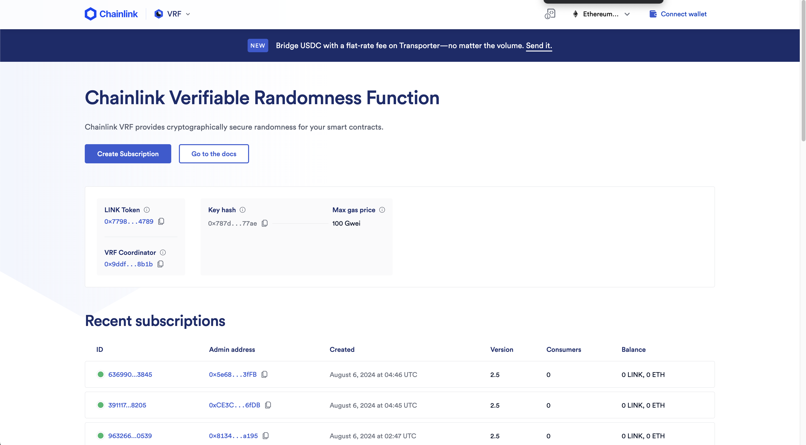
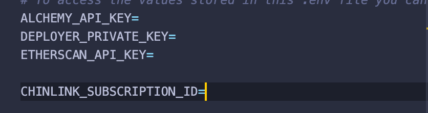
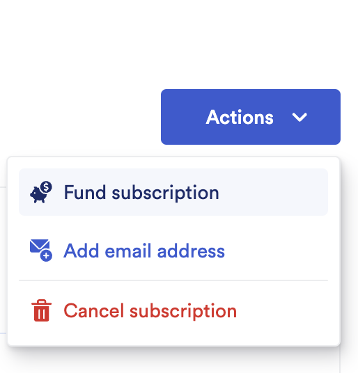
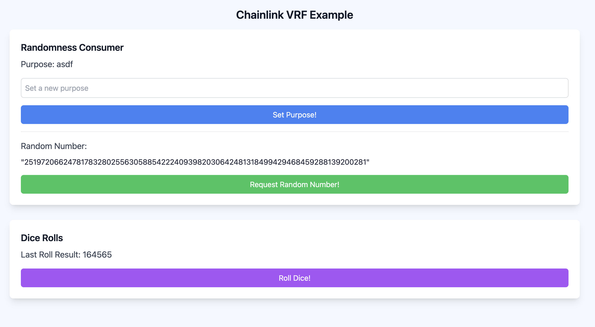

# Scaffold-ETH 2로 간단한 Oracle 사용 해보기 (Part1)

## 🚩 Step 0. Oracle

블록체인 오라클은 블록체인을 외부 시스템과 연결하여 스마트 계약이 현실 세계의 입력과 출력에 따라 실행될 수 있도록 하는 서비스이다.

예를 들어 실시간 가격 정보, 날씨 데이터, 결과를 확인해야 하는 게임 등의 정보를 스마트 계약에서 사용할 수 있다.

파트 1에서는 Oracle을 사용하여 스마트 계약과 외부 데이터를 연결하는 방법에 대해 알아본다.

> 🔥 이번 미션은 총 3개의 파트로 구성 되어있으며 파트 1과 파트 2에서는 chainlink의 VRF기능을 사용하여 랜덤 값을 가져오는 방법을, 파트 3에서는 APIConsumer를 사용하여 코인의 시세를 가져오는 예제를 구현한다.

> ❗️ Chainlink VRF 사용시 Subscription이 필요하므로 이번 미션에서는 hardhat 체인이 sepolia testnet에서 실행한다.<br/> 만일 hardhat에서 실행하고자 한다면 [[Chainlink VRF Docs]](https://docs.chain.link/vrf) 의 개발 문서를 참고한다.<br />

---

## 🚩 Step 1. 환경

Scaffod-ETH 2 프로젝트 생성 및 의존성 설치

=> 새로운 프로젝트를 생성할지 만들어놓은 프로젝트를 clone해갈지 추후 결정

```sh
git clone -b oracle-part1 --single-branch https://github.com/Ludium-Official/solidity-dapp-mission.git oracle-part1
cd oracle-part1
yarn install
```

터미널에서 프론트엔드 시작하기

```sh
yarn start
```

세 번째 터미널에서 스마트 계약 배포하기

```sh
yarn deploy --network sepolia

# 아래 구문을 통해 언제든지 새로운 스마트 계약을 배포할 수 있다.
yarn deploy --network sepolia --reset
```

📱 http://localhost:3000 으로 접속해서 애플리케이션 열기

---

## 🚩 Step 2. Subscription과 Fund

> ⛽️ Chainlink VRF를 사용하기 전에 [[Subscription]](https://vrf.chain.link/) 을 생성하고 Fund를 해야한다.

## 

1. chainlink에 회원가입을 한다.
2. VRF Subscription 페이지(위의 링크)로 들어간후 create subscription으로 자신의 subscription을 만든다.
3. 만들어진 Subscription으로 들어간후 ID값을 복사한다.
4. packages/hardhat의 .env파일의 subscription ID를 채워 준다.

5. 컨트랙트들을 배포해준다.
6. 다시 Chainlink Subscription Management 페이지로 돌아와 자신의 Subscription에 Fund를 넣어준다.

7. 프론트엔드를 실행하여 예제를 살펴본다.

---

## 🚩 Step 3. 기능 실행

`packages/nextjs/scaffold.config.ts`의 `targetNetwork`를 `chains.sepolia`로 변경한다.

`packages/nextjs/scaffold.config.ts`의 `onlyLocalBurnerWallet`를 false로 변경한다.

공공 테스트넷에 배포되었기 때문에 burner 지갑이 아닌 본인 소유의 지갑에 연결한다.



<br />

### Set Purpose!

원하는 문구를 작성하고 `Set Purpose!` 버튼을 클릭한다.

`RandomNumberConsumer.sol`의 `setPurpose()` 함수가 실행되고, 컨트랙트에 purpose가 저장된다.

```solidity
function setPurpose(string memory newPurpose) public {
    purpose = newPurpose;
}
```

### Random Number

`Request Random Number!` 버튼을 클릭하여, `RandomNumberConsumer.sol`의 `requestRandomNumber()` 함수를 실행한다.

> 참고로 이 함수는 스마트 계약 소유자만 실행할 수 있다.

함수가 실행되면 외부 시스템과의 상호작용을 통해 난수를 생성하는 요청을 보내고, 그 요청에 대한 상태를 저장하며, 이후 사용할 수 있도록 요청 ID를 반환한다.

```solidity
function requestRandomNumber(
    bool enableNativePayment
) external onlyOwner returns (uint256 requestId) {
    requestId = s_vrfCoordinator.requestRandomWords(
        VRFV2PlusClient.RandomWordsRequest({
            keyHash: keyHash,
            subId: s_subscriptionId,
            requestConfirmations: requestConfirmations,
            callbackGasLimit: callbackGasLimit,
            numWords: numWords,
            extraArgs: VRFV2PlusClient._argsToBytes(
                VRFV2PlusClient.ExtraArgsV1({
                    nativePayment: enableNativePayment
                })
            )
        })
    );
    s_requests[requestId] = RequestStatus({
        randomResult: 0,
        exists: true,
        fulfilled: false
    });
    requestIds.push(requestId);
    lastRequestId = requestId;
    emit RequestSent(requestId, numWords);
    return requestId;
}
```

스마트 계약에 저장된 가장 직전의 요청 ID (lastRequestId) 를 통해 s_requests 를 조회하고, 그 안의 randomResult를 사용자에게 보여준다.

```solidity
struct RequestStatus {
    bool fulfilled; 
    bool exists; 
    uint256 randomResult;
}
mapping(uint256 => RequestStatus) public s_requests; 

uint256 public lastRequestId;
```

### Dice Rolls

`Roll Dice!` 버튼을 클릭하여, `DiceRolls.sol`의 `requestRandomRoll()` 함수를 실행한다.

```solidity
function requestRandomRoll() public {
    s_vrfCoordinator.requestRandomWords(VRFV2PlusClient.RandomWordsRequest({
        keyHash: keyHash,
        subId: s_subscriptionId,
        requestConfirmations: requestConfirmations,
        callbackGasLimit: callbackGasLimit,
        numWords: numWords,
        extraArgs: VRFV2PlusClient._argsToBytes(VRFV2PlusClient.ExtraArgsV1({nativePayment: true}))
    }));
}
```

외부 시스템과의 상호작용을 통해 난수를 요청하는 것은 동일하지만, 여깃 Chainlink VRF 코디네이터의 역할이 하나 더 추가된다.

Chainlink VRF를 사용할 때, VRF 요청이 펜딩 상태에 있는 경우, 해당 요청이 완료되면 Chainlink VRF 코디네이터가 자동으로 사용자 스마트 계약의 fulfillRandomWords 함수를 호출하여 난수를 전달한다. 이 과정에서 Chainlink의 구독(subscription) 관리가 중요한 역할을 한다.

1.	VRF 요청:

	스마트 계약에서 requestRandomWords와 같은 메서드를 호출하여 난수를 요청

	이 요청은 Chainlink VRF 코디네이터에게 전송되며, 이때 구독 ID(subId)가 사용

2.	요청 대기:

	VRF 요청이 전송되면 블록체인 상에서 이 요청이 “펜딩” 상태로 대기

	Chainlink 노드가 이 요청을 받아들이고, 오프체인에서 난수를 생성하여 검증 가능한 형식으로 반환할 준비

3.	VRF 노드 작업:

	Chainlink 노드는 VRF 요청을 처리하기 위해 필요한 계산을 수행하고, 요청된 난수를 생성한 후 그 값을 블록체인에 제출

	이 과정에서 Chainlink는 요청한 난수를 검증 가능하도록 서명하여 제출

4.	fulfillRandomWords 호출:

	Chainlink 노드가 난수를 성공적으로 생성하고 블록체인에 제출하면, VRF 코디네이터가 예: fulfillRandomWords를 자동으로 호출

	이 함수는 난수 결과를 파라미터로 받아서, 스마트 계약 내에서 해당 난수를 활용

5.	구독 관리:
	Chainlink VRF 요청을 사용할 때, 구독은 요청을 처리하고 이를 수행하기 위한 자금을 관리하는 중요한 역할을 함

	사용자가 요청을 보낼 때 구독 ID를 포함하며, 이 구독이 요청의 결제를 담당하여 펀딩된 구독에서 비용이 차감

	구독에 충분한 자금이 있어야 요청이 처리될 수 있으며, 요청이 처리된 후 VRF 코디네이터가 이 자금으로 트랜잭션 수수료를 지불하고, 요청에 응답


```solidity
function fulfillRandomWords(
    uint256,
    uint256[] calldata randomWords
) internal override {
    randomResult = randomWords[0];
    uint256[] memory sixRandomNumbers = Utilities.expand(randomResult, 6);
    rollSet = [
        uint8(sixRandomNumbers[0] % 6) + 1,
        uint8(sixRandomNumbers[1] % 6) + 1,
        uint8(sixRandomNumbers[2] % 6) + 1,
        uint8(sixRandomNumbers[3] % 6) + 1,
        uint8(sixRandomNumbers[4] % 6) + 1,
        uint8(sixRandomNumbers[5] % 6) + 1
    ];
    emit Rolled(
        rollSet[0],
        rollSet[1],
        rollSet[2],
        rollSet[3],
        rollSet[4],
        rollSet[5]
    );
}
```

결과적으로 스마트 계약은 외부 입력 없이도 신뢰할 수 있는 난수 값을 안전하게 사용할 수 있게 된다.