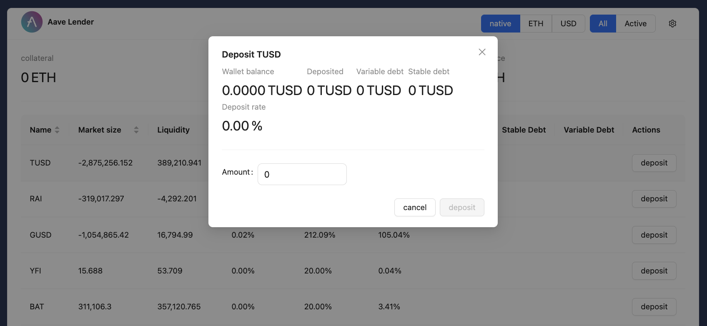

# Scaffold-ETH 2로 간단한 DEX 만들기

## 🚩 Step 0. DEX란?

DEX(Decentralized Exchange, 탈중앙화 거래소)는 암호화폐 구매자와 판매자를 연결하는 P2P 마켓플레이스를 말한다.

거래를 중앙 기관에서 관리하는 CEX(Centralized Exchange, 중앙화 거래소)와 달리, DEX는 스마트 계약을 사용하여 거래 프로세스를 자동화한다. 사용자가 한 암호화폐를 다른 암호화폐로 거래하고 싶을 때 자산을 스마트 계약으로 보내고, 스마트 계약은 매수 및 매도 주문을 자동으로 실행한다.

**DEX의 장점**

- 다양성:

  CEX는 일반적으로 수익성과 법적 준수를 보장하기 위해 적절한 거래 활동, 보급도, 효과적인 보안 표준을 갖춘 암호화폐만 상장한다. 반면 DEX에서는 거래량이 많지 않아도 P2P 거래가 가능하다.

- 신뢰성:

  DEX는 스마트 계약을 통해 거래를 실행하고 이를 블록체인에 기록하여 신뢰할 수 없는 거래를 가능하게 한다. 또한 자금을 보관하지 않으므로 해커의 표적이 될 가능성이 적다.

- 낮은 수수료:

  Ethereum 블록체인과 동일한 가스 수수료 구조를 사용하기 때문에 네트워크 사용에 따라 수수료가 변동하기도 하지만, 자체 실행 스마트 계약을 사용하기 때문에 중개자가 필요한 CEX에서 발생하는 비용보다 훨씬 낮다.

- 개인정보 보호:

  거래자는 지갑이 외부에 보관되고 DEX가 자금에 대한 책임을 지지 않기 때문에 개인 키를 공개할 필요가 없다.

**DEX의 단점**

- 확장성:

  DEX는 블록체인 네트워크에 있는 스마트 계약을 사용하여 기능하기 때문에 기본 네트워크 인프라의 한계에 따라 제한된다.

- 사용자 경험:

  DEX는 개발 초기 단계에 있으며 분산형 블록체인 기술에 익숙하지 않은 사람들에게는 사용하기 어려울 수 있다. 먼저, 사용자는 DEX와 상호 작용할 수 있도록 외부 지갑 플랫폼에 익숙해져야 하고, 법정 통화나 암호화폐를 이체하여 지갑에 자금을 조달해야 한다. 마지막으로, 이 지갑을 DEX 인터페이스에 연결하여 거래를 실행해야 한다.


> **[대표적인 DEX]** <br/>
[Uniswap](https://app.uniswap.org/), [SushiSwap](https://www.sushi.com/swap), [PancakeSwap](https://pancakeswap.finance/swap) 등 <br/><br/>
**[대표적인 CEX]** <br/>
[Binance](https://www.binance.com/), [Coinbase Exchange](https://exchange.coinbase.com), [Upbit](https://upbit.com/) 등


> 🔥 이번 미션에서는 하나의 토큰 쌍(ERC20 BALLOONS ($BAL)와 ETH)으로 구성된 간단한 탈중앙화 거래소를 구축하고, 토큰을 거래할 수 있는 웹앱 프론트엔드를 제작한다.

---

## 🚩 Step 1. 환경

프로젝트 클론해가기

```sh
git clone https://github.com/Ludium-Official/solidity-dapp-mission.git token-swap
cd token-swap
yarn install
```
---

### Op1) 로컬 환경에서 실행

```sh
# 로컬 블록체인 초기화
yarn chain

# 스마트 계약 배포
yarn deploy

# 프론트엔드 실행
yarn start
```

📱 http://localhost:3000 으로 접속해서 애플리케이션 열기

---

### Op2) 테스트넷 환경에서 실행

**🪪 배포자 (Deployer) 설정**

***방법 1. 배포자 주소를 생성하여 사용***

주소가 생성되면 니모닉은 로컬에 저장되고, 프라이빗 키를 따로 입력하지 않고 계약을 배포할 수 있다.

```sh
# 배포자 주소 생성
yarn generate

# 로컬 계정 잔액 확인
yarn account
```
위에서 생성된 주소로 sepoliaETH를 보내거나 공개 faucet에서 받는다.

***방법 2. 실제 소유한 주소를 사용***

`packages/hardhat/.env` 및 `packages/nextjs/.env.local`을 수정한다.

```bash
# .env
ALCHEMY_API_KEY=
DEPLOYER_PRIVATE_KEY=
```
본인 계정의 [Alchemy](https://dashboard.alchemy.com/apps) Apps API key와 소유하고 있는 지갑의 프라이빗 키를 기입한다.

> Metamask 지갑의 경우, 계정 세부 정보로 들어가면 프라이빗 키를 얻을 수 있다.

<br/>

**🪝 배포하기**

***방법 1. defaultNetwork 설정***
`packages/hardhat/hardhat.config.ts`에서 defaultNetwork를 `sepolia`로 변경한다.

```sh
yarn deploy
```

***방법 2. 명령에서 네트워크 지정***
```sh
yarn deploy --network sepolia
```

<br/>

**🏛️ 프론트엔드 배포하기**

`packages/nextjs/scaffold.config.ts`를 아래처럼 변경한다.

```typescript
const scaffoldConfig = {
  targetNetworks: [chains.sepolia],

  // ...

  onlyLocalBurnerWallet: false,
} as const satisfies ScaffoldConfig;
```

NestJS 애플리케이션을 배포한다. [Vercel](https://vercel.com/) 에서 로그인 후 dashboard로 이동해 `Add New -> Project` 를 클릭한 후 GitHub repository를 임포트해온다.

```shell
yarn vercel
```

📱 Vercel이 제공하는 url 로 접속해서 애플리케이션 열기

---

## 🚩 Step 2. 초기화 (Init)

`packages/hardhat/deploy/00_deploy_your_contract.ts`를 보면 컨트랙트 2개가 배포된 후, 배포자에게 민팅된 1000개의 BAL 중 100개를 DEX에게 권한 위임하고, DEX를 초기화 하는 과정을 거친다.

`DEX` 탭을 보면 초기 유동성으로 ETH와 BAL이 각 5개씩 공급된 것과 현재 총 유동성 총량(totalLiquidity)가 5인 것을 확인할 수 있다. (초기 유동성은 1:1 비율로 형성됨)


---

## 🚩 Step 3. 가격 (Price)

토큰 쌍을 하나의 Pool에서 보유하고 있을 때, 두 자산 간의 환율을 결정하기 위한 간단한 공식을 사용할 수 있다.

```
x * y = k
```
여기서 `x`와 `y`는 각각의 자산 보유량(reserves)을 나타내고, `k`는 변하지 않는 상수(invariant)를 나타낸다.

이 공식을 그래프로 만들면 다음과 같은 곡선이 된다.


우리는 단순히 하나의 자산을 다른 자산으로 교환하고 있으며, 특정 양의 입력 자산에 따라 얼마나 많은 출력 자산을 받을 수 있는지를 가격으로 나타낸다.

이와 같은 곡선을 기반으로 한 시장은 항상 유동성을 유지하지만, 만약 비율이 불균행지면 동일한 거래 금액으로 얻을 수 있는 자산의 양은 점점 줄어든다.

예를 들어 초기 유동성의 비율은 1:1로 시작 되었지만, 여러 차례의 swap을 통해 ETH가 줄어들고 BAL이 늘어난다면 1 BAL을 지불하여 현저하게 적은 ETH를 받게 될 수도 있다.

```solidity
// 유동성 풀의 가격을 계산
function price(
  uint256 xInput, // 스왑하려는 토큰의 입력 양
  uint256 xReserves, // 스왑할 토큰의 현재 풀에 있는 양
  uint256 yReserves // 스왑 받을 토큰의 현재 풀에 있는 양
) public pure returns (uint256 yOutput) {
  uint256 xInputWithFee = xInput * 997; // 0.3% 수수료 적용
      uint256 numerator = xInputWithFee * yReserves;
      uint256 denominator = (xReserves * 1000) + xInputWithFee;
      return numerator / denominator; // 스왑 받을 토큰의 출력 양
}
```

> 🤑 가격을 계산할 때 거래 수수료 0.3%가 추가하게 되는데, 추후 유동성 공급자들에게 유동성 공급에 대한 인센티브로 제공된다.

---

## 🚩 Step 4. 교환 (Trading)

`ethToToken`과 `tokenToETH`를 실행해보자.

먼저 `ethToToken`을 실행할 때는, 지불할 ETH의 수량을 입력한다.


스마트 계약은 현재 Pool에서 보유하고 있는 각 토큰의 수량을 통해 사용자가 지불한 ETH와 상응하는 BAL의 개수를 계산하여 오른쪽 그래프에서 보여준다.

`Send` 버튼을 클릭하면, 스마트 계약에 있는 ethToToken() 함수가 자동으로 실행되면서 ETH를 컨트랙트로 보내고, 토큰을 사용자에게 전송한다.


사용자에게 0.3% 수수료가 제외된 BAL이 들어와있고, ETH와 BAL의 비율이 변경된 것을 확인할 수 있다.

다음으로는 지불할 BAL을 입력하여 `tokenToETH`를 실행한다.


> ⚠ ETH를 가지고 Balloons 토큰을 거래할 때는 approve()를 통해 DEX에게 충분한 수량의 토큰이 권한 위임 되었는지 확인해보자.


---

## 🚩 Step 4. 유동성 (Liquidity)

이번에는 Pool의 유동성을 공급, 제거 해보자.

먼저 `Deposit`으로 유동성을 공급한다. 공급하고자 하는 ETH 수량을 입력하면 동일한 비율의 BAL이 함께 공급되기 때문에 2개의 자산 모두 충분한 양을 보유하고 있어야 하며, 해당 수량만큼 DEX에게 권한 위임(approve)을 해야 한다.

유동성 공급이 이루어진 후, `Events` 탭으로 이동하여 공급된 ETH, BAL의 수량과 LP Token의 수량을 함께 확인할 수 있다.



추후 해당 Pool에서 거래가 이루어질 때마다 지불되는 0.3%의 수수료를 유동성 공급량에 따라 인센티브로 받을 수 있다.

이번에는 `Withdraw`로 유동성을 제거 해보자.

사용자가 보유하고 있는 LP Token에서 제거하고자 하는 수량을 입력한 후 `Send` 버튼을 클릭한다.

보유하고 있는 LP Token 수량 이상을 제거할 수 없고, 제거된 LP Token의 수량에 상응하는 ETH와 BAL을 돌려받는다.


